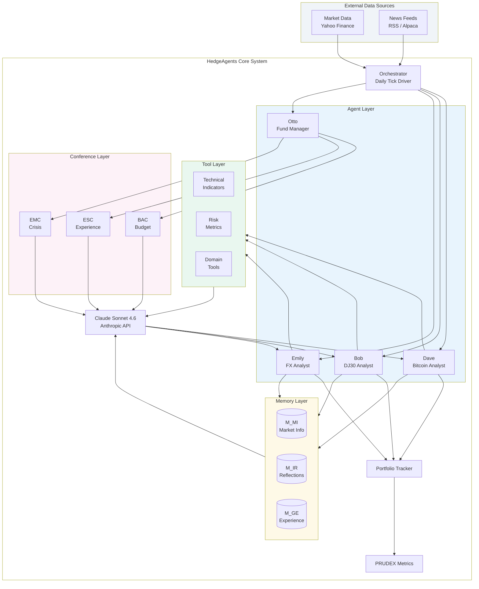
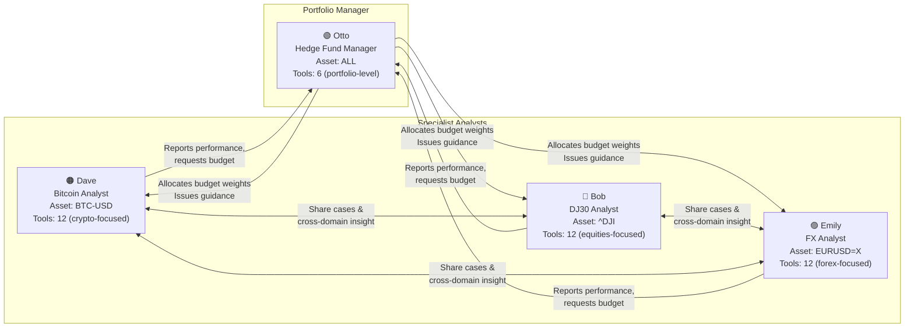
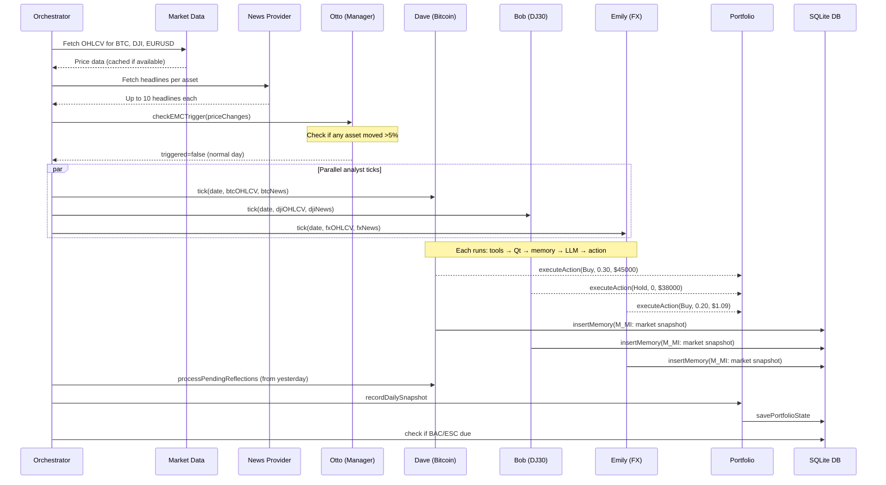

# Chapter 1 — System Overview

## What Is HedgeAgents?

HedgeAgents is a **multi-agent LLM-powered financial analysis system** that simulates the internal architecture of a real hedge fund. Instead of a single AI making all investment decisions, it deploys a team of specialized agents — each with their own domain expertise, memory, tools, and decision-making process — that collaborate through structured conferences.

The system was originally described in the academic paper:
> *"HedgeAgents: A Balanced-aware Multi-agent Financial Trading System"*  
> Ziyan Liu et al., WWW '25 — [arxiv.org/abs/2502.13165](https://arxiv.org/abs/2502.13165)

The original paper demonstrated **70% annualised return, 400% total return over 3 years** using GPT-4. This implementation uses **Claude Sonnet 4.6**.

---

## The Core Problem Being Solved

Single-agent LLM trading systems suffer from several fundamental weaknesses:

| Problem | Single Agent | HedgeAgents Solution |
|---------|-------------|----------------------|
| **Narrow expertise** | One model covers all assets | Specialist agents per asset class |
| **No learning** | No memory between sessions | 3 memory types persist decisions + lessons |
| **No cross-validation** | Decisions unchecked | Peers challenge each other in conferences |
| **Static risk** | Fixed allocation | Dynamic budget reallocation every 30 days |
| **Crisis blindness** | No emergency response | Automatic Extreme Market Conference |
| **Overconfidence** | Self-consistent echo chamber | Manager synthesizes divergent views |

---

## High-Level Architecture



---

## The Four Agents at a Glance



---

## Three Types of Collaboration (Conferences)

```mermaid
graph TD
    subgraph BAC["💼 Budget Allocation Conference (Every 30 days)"]
        B1[Analysts report P&L + budget request] --> B2[Otto runs portfolio optimizer]
        B2 --> B3[Otto decides final weights]
        B3 --> B4[Budget weights updated]
    end

    subgraph ESC["🔄 Experience Sharing Conference (Every 30 days)"]
        E1[Each analyst presents best trade] --> E2[Peers give cross-domain feedback]
        E2 --> E3[Insights distilled into M_GE]
    end

    subgraph EMC["🚨 Extreme Market Conference (Triggered by >5% daily move)"]
        C1[Crisis agent presents loss situation] --> C2[Peers offer aggressive/conservative suggestions]
        C2 --> C3[Otto synthesizes balanced guidance]
        C3 --> C4[Crisis agent makes final decision]
    end
```



---

## Technology Stack

```mermaid
graph LR
    subgraph RUNTIME["Runtime"]
        NODE[Node.js v22<br/>CommonJS modules]
    end

    subgraph LLM_LAYER["LLM Layer"]
        CLAUDE[Anthropic API<br/>Claude Sonnet 4.6<br/>Pure HTTPS, no SDK]
        VOYAGE[Voyage AI<br/>voyage-finance-2<br/>Embeddings - optional]
    end

    subgraph DATA_LAYER["Data Layer"]
        SQLITE[SQLite<br/>better-sqlite3<br/>Memory + Portfolio]
        YAHOO[Yahoo Finance<br/>yahoo-finance2<br/>OHLCV data]
        RSS[RSS Feeds<br/>News headlines<br/>Free, no API key]
    end

    subgraph MATH["Math Layer"]
        MATH[Pure JS Math<br/>No native deps<br/>Portfolio optimization]
    end

    NODE --> CLAUDE
    NODE --> VOYAGE
    NODE --> SQLITE
    NODE --> YAHOO
    NODE --> RSS
    NODE --> MATH
```

---

## Data Flow: One Trading Day



---

## File Structure

```
hedge-agents/
├── config/                 ← All configuration (no code changes needed)
│   ├── agents.json         ← Who the agents are + which assets
│   ├── data-sources.json   ← Market data + news feed config
│   ├── portfolio.json      ← Capital, risk params (λ1, λ2, λ3)
│   ├── schedule.json       ← Conference intervals, EMC thresholds
│   └── llm.json            ← Model, tokens per prompt type
│
├── profiles/               ← Agent personalities (XML, swappable)
│   ├── dave.xml            ← Bitcoin Analyst
│   ├── bob.xml             ← DJ30 Analyst
│   ├── emily.xml           ← FX Analyst
│   └── otto.xml            ← Hedge Fund Manager
│
├── src/
│   ├── config.cjs          ← Config loader (merges JSON + env vars)
│   ├── index.cjs           ← Main orchestrator
│   ├── llm/
│   │   ├── claude-client.cjs   ← Anthropic API client
│   │   └── prompt-builder.cjs  ← All 12 prompt templates
│   ├── memory/
│   │   ├── memory-store.cjs    ← SQLite CRUD for all memory types
│   │   └── embeddings.cjs      ← TF-IDF + Voyage AI retrieval
│   ├── tools/
│   │   ├── technical.cjs       ← RSI, MACD, BB, ATR, Stochastic...
│   │   ├── risk.cjs            ← VaR, CVaR, Sharpe, Sortino, MDD
│   │   ├── domain.cjs          ← Crypto, equities, FX, portfolio tools
│   │   └── registry.cjs        ← Tool dispatcher
│   ├── agents/
│   │   ├── base-agent.cjs      ← Core loop (all agents inherit)
│   │   ├── analyst-agent.cjs   ← Dave, Bob, Emily
│   │   ├── manager-agent.cjs   ← Otto
│   │   └── profile-loader.cjs  ← XML → JS object
│   ├── conferences/
│   │   ├── bac.cjs             ← Budget Allocation Conference
│   │   ├── esc.cjs             ← Experience Sharing Conference
│   │   └── emc.cjs             ← Extreme Market Conference
│   ├── data/
│   │   ├── market-data.cjs     ← Yahoo Finance wrapper + mock
│   │   └── news-provider.cjs   ← Alpaca / RSS / mock headlines
│   ├── portfolio/
│   │   ├── tracker.cjs         ← Position tracking, trade execution
│   │   └── metrics.cjs         ← PRUDEX (9 metrics)
│   └── utils/
│       ├── logger.cjs          ← Structured colored console logger
│       ├── math.cjs            ← Stats, portfolio optimizer, cosine sim
│       └── date-utils.cjs      ← Trading calendar helpers
│
├── scripts/
│   ├── backtest.cjs        ← Historical simulation runner
│   ├── paper-trade.cjs     ← Live paper trading (one day)
│   └── seed-memory.cjs     ← Pre-populate expert principles
│
├── templates/
│   ├── README.md           ← Domain swap guide
│   └── example-domains/    ← Crypto-only, macro, equity-sector configs
│
├── tests/
│   ├── unit/               ← 87 unit tests (tools, memory, portfolio, profiles)
│   └── integration/        ← 6 integration tests (agent loop, BAC)
│
└── data/
    └── hedge-agents.db     ← SQLite database (auto-created)
```
