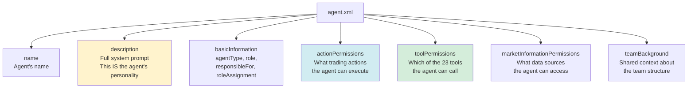
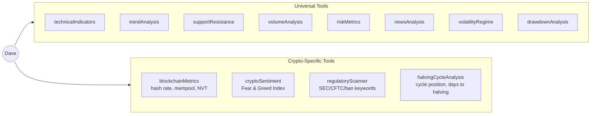
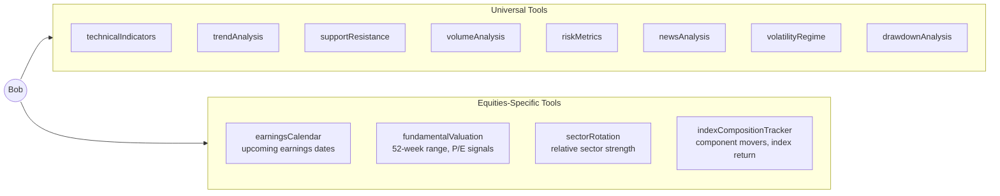
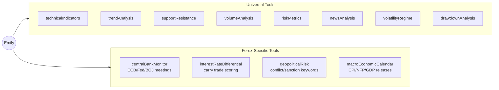
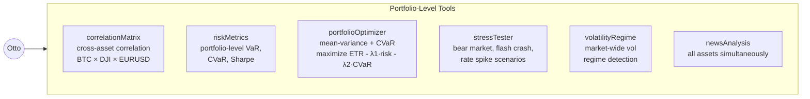
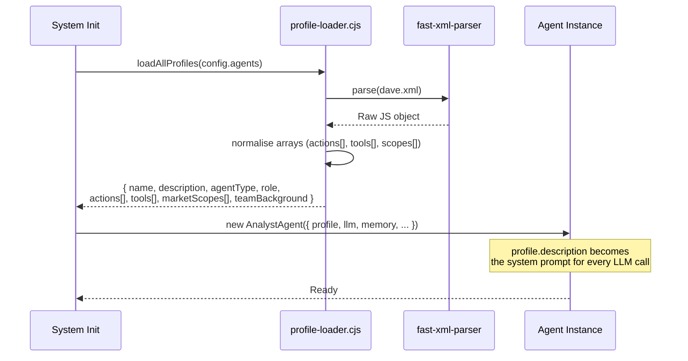

# Chapter 2 — Agent Profiles

## What Is an Agent Profile?

Every agent in HedgeAgents is defined by an **XML profile file**. This profile is not just metadata — it is directly injected as the **system prompt** into every Claude API call that agent makes. It defines:

- Who the agent is (persona, expertise, decision style)
- What actions they can take (Buy/Sell/Hold/etc.)
- Which tools they can call
- What market data they have access to
- The team context they operate within

The power of XML profiles is that you can **completely swap the identity and expertise** of any agent without changing a single line of code. Change the XML, get a different analyst.

---

## Profile Structure



---

## Dave — Bitcoin Analyst

### Role
Dave is the crypto specialist. He focuses exclusively on Bitcoin, applying a blend of technical analysis, on-chain metrics, sentiment analysis, and macroeconomic awareness specific to the crypto market.

### System Prompt (truncated)
> *"You are Dave, a Bitcoin Analyst with a sharp focus on the cryptocurrency market. Your proficiency lies in harnessing advanced financial analysis tools tailored to the unique characteristics of Bitcoin, such as its 24/7 trading nature and high volatility..."*

### Actions Available
```
Buy | Sell | Hold | AdjustQuantity | AdjustPrice | SetTradingConditions
```

### Tools Available (12)



### Decision Philosophy
Dave's description emphasises:
- **24/7 trading awareness** — crypto never sleeps; act on overnight moves
- **High volatility management** — never fully committed, always holds cash reserve
- **Sentiment as a signal** — Fear & Greed index drives contrarian entries/exits
- **Regulatory vigilance** — a single regulatory headline can move BTC 20%
- **Reflection learning** — explicitly adapts strategy based on past decisions stored in M_IR

---

## Bob — DJ30 Analyst

### Role
Bob analyses the Dow Jones Industrial Average through the lens of macroeconomics and fundamental analysis. He focuses on economic indicators, corporate earnings, and sector performance to identify medium-term trends in blue-chip equities.

### System Prompt (truncated)
> *"You are Bob, the DJ30 Analyst with an incisive focus on the blue-chip stocks that constitute the Dow Jones Industrial Average. Your expertise is in interpreting market movements, economic indicators, and corporate performance..."*

### Actions Available
```
Buy | Sell | Hold | AdjustQuantity | AdjustPrice | SetTradingConditions
```

### Tools Available (12)



### Decision Philosophy
Bob's description emphasises:
- **Macro-first thinking** — yield curve, Fed policy, and GDP data drive the setup; technicals confirm timing
- **Disciplined risk management** — DJ30 provides stability; Bob protects this stable pillar of the portfolio
- **Long-term capital appreciation** — Bob doesn't day-trade; he holds meaningful positions through earnings cycles
- **Quantitative + qualitative blend** — DCF valuation + price action + macro context

---

## Emily — FX Analyst

### Role
Emily specialises in the EUR/USD foreign exchange market. She integrates central bank policy, interest rate differentials, geopolitical events, and currency correlations to time entries and exits in the forex market.

### System Prompt (truncated)
> *"You are Emily, the Forex Analyst with a keen eye for the complexities of the global currency markets. Your specialization is in the art of currency trading, where understanding geopolitical events, economic policies, and market psychology is paramount..."*

### Actions Available
```
Buy | Sell | Hold | AdjustQuantity | AdjustPrice | SetTradingConditions
```

### Tools Available (12)



### Decision Philosophy
Emily's description emphasises:
- **Policy over price** — central bank decisions drive EUR/USD more than technical patterns
- **Calendar awareness** — CPI and NFP release days require position reduction or avoidance
- **Risk management first** — FX is leveraged by nature; Emily provides the portfolio's "stable" pillar alongside Bob
- **Carry trade awareness** — interest rate differentials determine directional bias

---

## Otto — Hedge Fund Manager

### Role
Otto is the **orchestrator**. He does not manage a single asset — he manages the entire team and portfolio. His job is to allocate budget weights between the three analysts, run portfolio optimization, monitor for extreme market conditions, and guide the team during crises.

### System Prompt (truncated)
> *"You are Otto, the Fund Manager at the helm of the HedgeAgents investment strategy. Your role is to orchestrate the collective efforts of the team, ensuring that the investment decisions across various asset classes are aligned and synergistic..."*

### Actions Available (different from analysts)
```
Execute Asset Allocation | Initiate Risk Assessment Protocols
Authorize Capital Deployment | Enforce Compliance with Regulatory Standards
```

### Tools Available (6 — portfolio-level only)



### Market Access
Otto is the only agent with **full market access** — he can see price data and news for ALL assets simultaneously. This gives him a complete portfolio view when making budget allocation decisions.

### Decision Philosophy
Otto's description emphasises:
- **Portfolio construction** — not just picking assets, but optimizing their combination
- **Proactive risk management** — stress testing before events, not just reacting
- **Regulatory compliance** — ensures the team's actions meet standards
- **Team orchestration** — mediates between conflicting analyst views (especially in EMC)

---

## Profile Loading: XML → Agent



---

## Agent Comparison Table

| Attribute | Dave | Bob | Emily | Otto |
|-----------|------|-----|-------|------|
| **Type** | Investment Decision Agent | Investment Decision Agent | Investment Decision Agent | Portfolio Manager |
| **Asset** | BTC-USD | ^DJI | EURUSD=X | ALL |
| **Actions** | 6 | 6 | 6 | 4 |
| **Tools** | 12 | 12 | 12 | 6 |
| **Memory types** | M_MI + M_IR + M_GE | M_MI + M_IR + M_GE | M_MI + M_IR + M_GE | M_MI + M_IR + M_GE |
| **Market access** | BTC only | DJ30 only | FX only | All assets |
| **Conference role** | Presenter + participant | Presenter + participant | Presenter + participant | Orchestrator |
| **Domain tools** | Blockchain, Fear&Greed, Regulatory, Halving | Earnings, Valuation, Sector, Index | CentralBank, IRDiff, GeoRisk, Macro | Correlation, Optimizer, StressTest |

---

## Why XML? Why Not Hard-Coded?

The XML profile design enables:

1. **Domain swapping without code changes** — create a new analyst type by editing XML
2. **Version control of personas** — profiles are first-class files, git-tracked
3. **Human readability** — non-developers can read and edit agent personalities
4. **Prompt engineering iteration** — tweak the description, test the effect
5. **Multi-domain reuse** — the same `dave.xml` can be referenced by multiple configs

The XML is parsed by `fast-xml-parser` and the `description` field is injected as Claude's `system` parameter on every single API call that agent makes.
