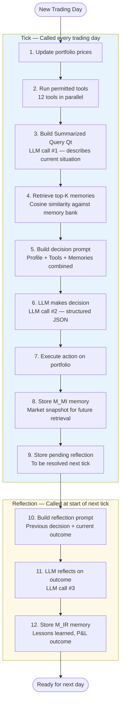
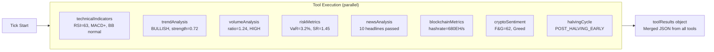
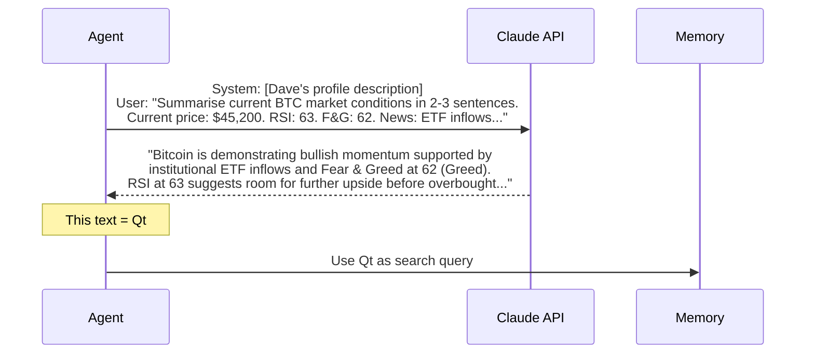
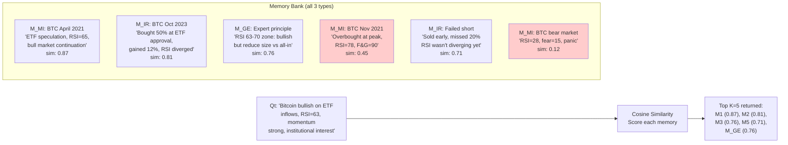
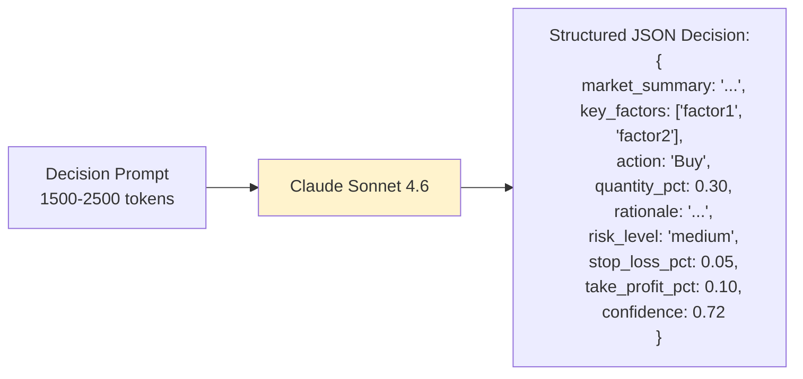
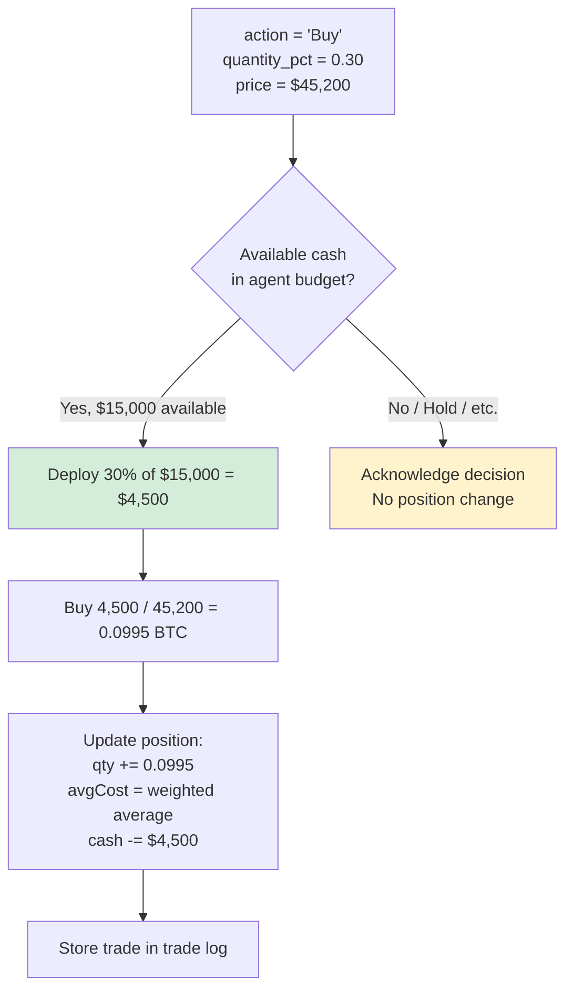
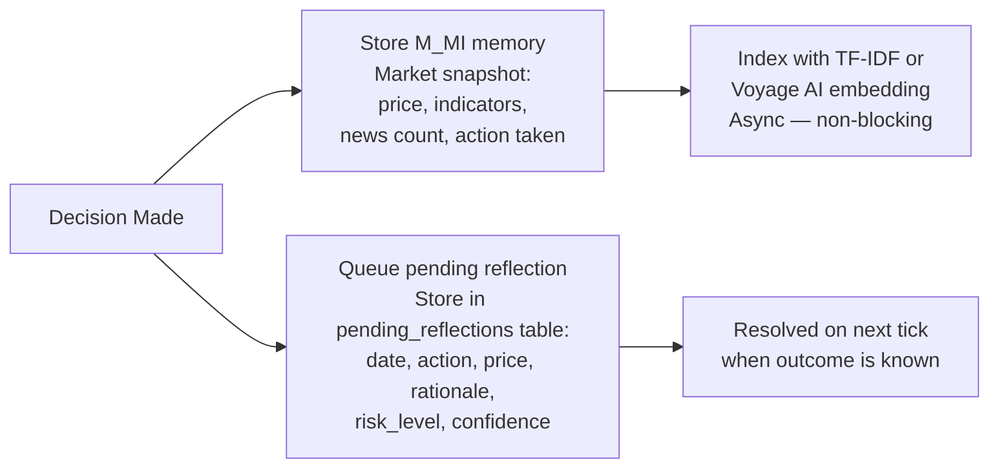

# Chapter 3 — The Single Agent Decision Loop

## Overview

Every analyst agent (Dave, Bob, Emily) runs the same **7-step decision loop** on each trading day. This is the core intellectual engine of HedgeAgents. It transforms raw market data into a structured, memory-informed investment decision — and then learns from the outcome.

The loop is implemented in `src/agents/base-agent.cjs` and called by the orchestrator for each agent on each tick.

---

## The Complete Loop



---

## Step 1: Update Portfolio Prices

Before anything else, the agent updates its current price in the portfolio tracker. This ensures the portfolio value calculation is based on real-time data before making a decision.

```javascript
const price = ohlcv.closes[ohlcv.closes.length - 1]; // Today's close
portfolio.updatePrices({ [agentName]: price });
```

---

## Step 2: Run Tools

The agent dispatches all tools listed in its `<toolPermissions>` XML section. Tools run **in parallel** using `Promise.allSettled()` — a failed tool never blocks the others.



**Key principle:** Tools do not make LLM calls. They are deterministic functions that transform price data into structured metrics. The LLM only sees the output, not the calculations.

---

## Step 3: Build Summarized Query Qt

This is **LLM Call #1** — a lightweight, focused call. The agent summarises the current market situation in 2-3 sentences. This summary is called **Qt** (the query at time t) and serves two purposes:

1. It will be used as the **search query** for memory retrieval (Step 4)
2. It is stored in M_MI as a readable description of the market state



**Why not just skip this and search with raw tool output?**

Raw tool output is structured JSON — hard to similarity-match. Qt is natural language that captures the *meaning* of the situation, enabling much better semantic retrieval of past similar situations.

---

## Step 4: Memory Retrieval

The agent searches its **entire memory bank** for the K=5 most similar past situations to the current Qt.



The bottom memories (sim < 0.5) are discarded. Only the top 5 most relevant are passed to the LLM in the next step.

**Two retrieval methods:**

| Method | How it works | When used |
|--------|-------------|-----------|
| **TF-IDF** | Tokenise text, build word-frequency vectors, cosine similarity | Default (no API key needed) |
| **Voyage AI** | `voyage-finance-2` model embeds text into 1024-dim float vectors, cosine similarity | When `VOYAGE_API_KEY` is set — higher quality, finance-tuned |

---

## Step 5: Build Decision Prompt

Now everything is assembled into the **master decision prompt** — the most important prompt in the system. It combines:

```
[Agent personality from XML profile]
    +
[Current market environment:
  - Current/Open/High/Low/Previous close
  - News headlines (up to 10)
  - All tool results (technicals, risk, domain-specific)]
    +
[Retrieved memories (top 5 similar past situations)]
    +
[Current portfolio state (positions, cash, budget)]
    +
[JSON response schema]
```

This prompt is typically **1500-2500 tokens** of rich context. The LLM sees the agent's persona, all market data, tools analysis, and 5 relevant past experiences simultaneously.

---

## Step 6: LLM Decision (Call #2)

This is the **main decision call** — the most expensive and important LLM call in the loop.



**JSON is enforced** — the client appends `"Your response MUST be valid JSON only"` to the system prompt and retries if parsing fails.

**Key fields explained:**

| Field | Meaning | How it's used |
|-------|---------|---------------|
| `action` | Buy / Sell / Hold / AdjustQuantity etc. | Passed to `portfolio.executeAction()` |
| `quantity_pct` | 0.0–1.0 fraction of available cash to deploy | Determines trade size |
| `stop_loss_pct` | e.g. 0.05 = 5% below entry | Stored for trigger monitoring |
| `take_profit_pct` | e.g. 0.10 = 10% above entry | Stored for trigger monitoring |
| `confidence` | 0.0–1.0 self-assessment | Stored in M_IR for meta-analysis |
| `rationale` | Full explanation of decision | Stored in M_IR + pending reflection |

---

## Step 7: Execute Action

The portfolio tracker processes the decision:



**Budget constraints:**
- Each analyst can only deploy funds within their allocated budget weight
- e.g. if Dave's weight = 0.50, he controls 50% of total portfolio value
- `getAgentAvailableCash()` = `(totalValue × weight) − currentPosition`

---

## Step 8 & 9: Store Memory + Queue Reflection

After the decision:



---

## The Reflection Loop (Next Tick)

At the start of the **next tick**, before making new decisions, the agent processes its pending reflections from yesterday:

```mermaid
sequenceDiagram
    participant AGENT as Agent
    participant DB as SQLite
    participant LLM as Claude API

    AGENT->>DB: getPendingReflections(agentName)
    DB-->>AGENT: [{ date: yesterday, action: Buy,<br/>price: $45,200, rationale: "..." }]

    Note over AGENT: Current price today is $47,100

    AGENT->>AGENT: Compute outcome<br/>pnlPct = (47100 - 45200) / 45200 = +4.2%

    AGENT->>LLM: Reflection prompt:<br/>"You bought at $45,200 with rationale X.<br/>Price is now $47,100 (+4.2%).<br/>What did you learn?"

    LLM-->>AGENT: {
      outcome_assessment: "Good decision...",
      what_worked: "RSI + sentiment alignment",
      what_failed: "Could have sized larger",
      lesson: "Institutional ETF flows reliable signal",
      experience_score: 0.85
    }

    AGENT->>DB: insertMemory(M_IR, reflection content,<br/>pnl_outcome=0.042, experience_score=0.85)
    AGENT->>DB: markReflectionResolved(id)
```

**This reflection is crucial.** It's what gives agents a learning mechanism. High `experience_score` memories are prioritised when the agent generates ESC cases, and all M_IR memories are eligible for retrieval in future similar situations.

---

## Token Budget Per Agent Per Day

| Call | Purpose | Approx Tokens In | Approx Tokens Out |
|------|---------|-----------------|------------------|
| Qt summary | Summarise current situation | 500 | 100 |
| Decision | Full decision with memories | 2,000 | 400 |
| Reflection | Reflect on yesterday's trade | 600 | 300 |
| **Per agent/day** | | **~3,100** | **~800** |
| **3 analysts/day** | | **~9,300** | **~2,400** |
| **30-day cycle** | | **~279,000** | **~72,000** |

**Estimated cost:** ~$0.84 for input + ~$1.08 for output = **~$1.92 per 30-day cycle per analyst team**

---

## Error Handling

Every step is wrapped in try/catch. If any step fails, the agent falls back gracefully:

```mermaid
graph TD
    TOOLS_FAIL[Tool fails] --> PARTIAL[Continue with partial results<br/>_errors field in toolResults]
    QT_FAIL[Qt generation fails] --> FALLBACK_QT[Use fallback Qt:<br/>"AgentName on date: market analysis"]
    MEM_FAIL[Memory retrieval fails] --> EMPTY_MEM[Proceed with 0 memories]
    LLM_FAIL[LLM decision fails] --> DEFAULT[Default to Hold action<br/>Log error prominently]
    REFLECT_FAIL[Reflection fails] --> MARK_DONE[Mark resolved, don't retry<br/>Log warning]
```

**No single failure can crash the system.** The orchestrator uses `Promise.allSettled()` for parallel ticks, so if Dave's tick throws, Bob and Emily's ticks complete normally.
