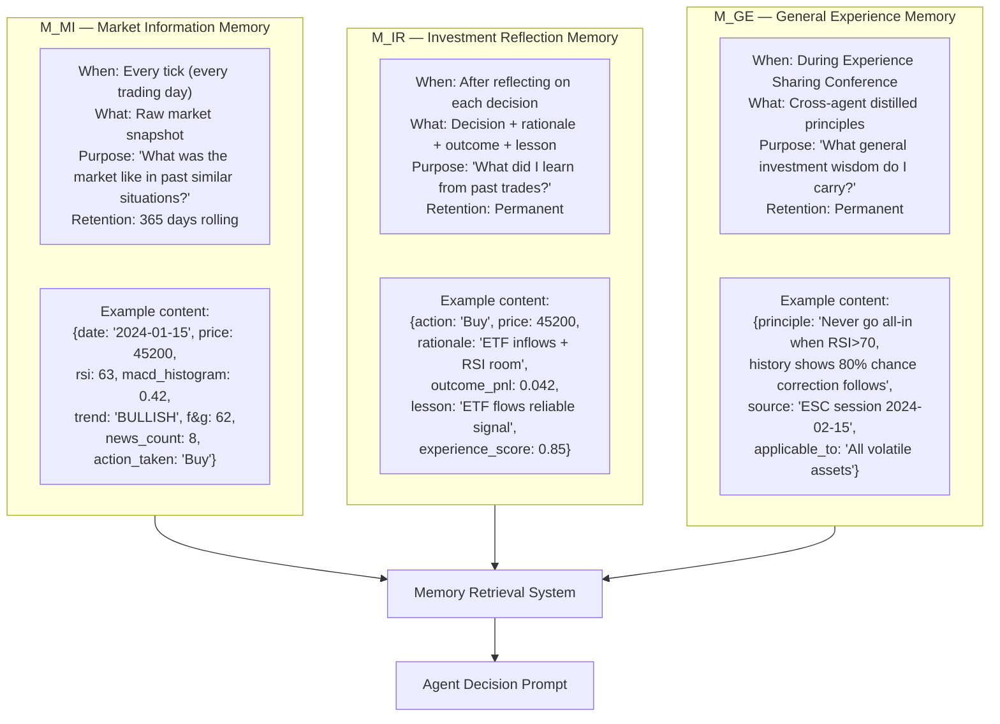
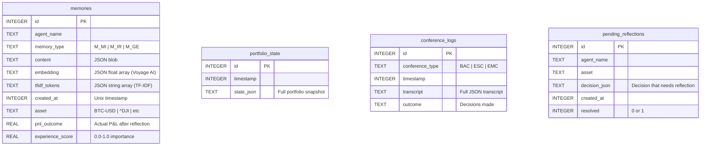
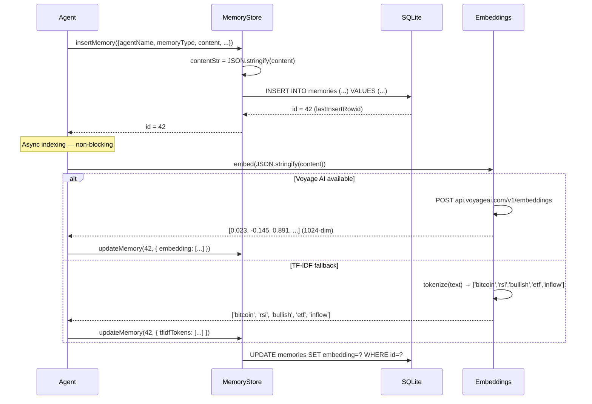
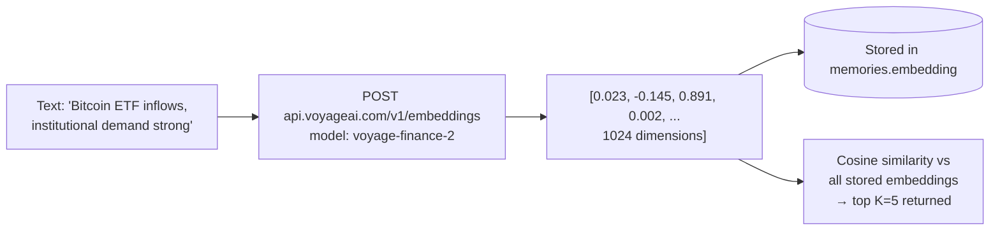
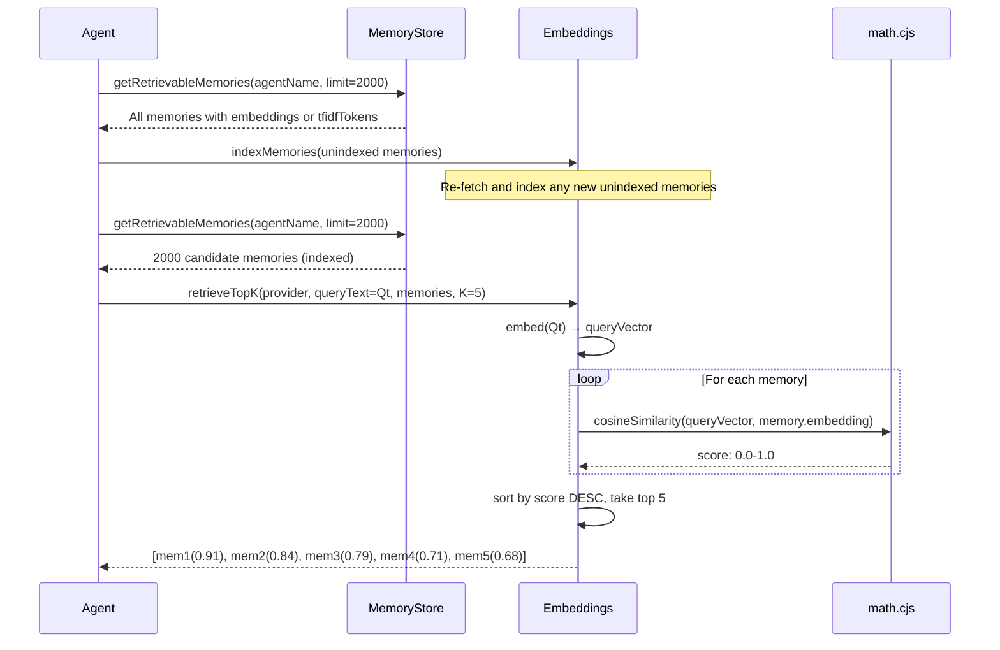
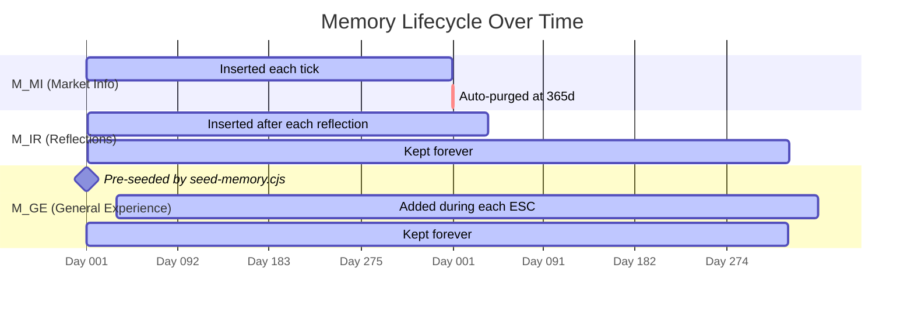
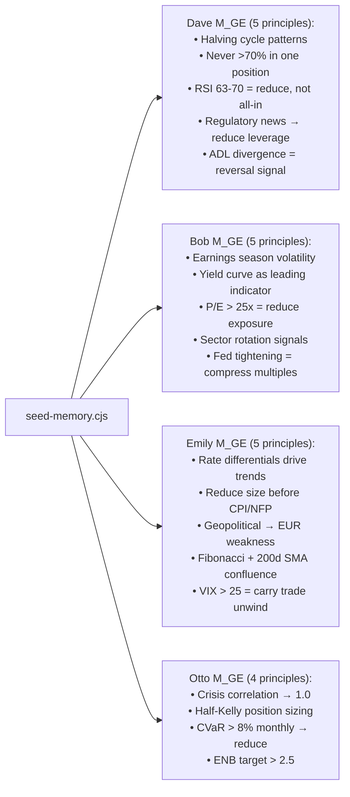

# Chapter 4 — The Memory System

## Why Memory Matters

An LLM without memory has no history. It can't say "I tried this in a similar situation before and it failed." It can't learn from mistakes. It can't apply patterns from months ago. HedgeAgents solves this with a **three-tier persistent memory system** stored in SQLite.

The memory system answers the question: *"Have I seen a situation like this before, and what happened?"*

---

## Three Memory Types



---

## Memory Store Architecture



---

## Memory Insertion Flow



---

## Memory Retrieval: How Similarity Works

The retrieval system answers: *"Which past memories are most relevant to the current situation?"*

### TF-IDF Retrieval (Default)

**TF-IDF** = Term Frequency × Inverse Document Frequency. It measures how important a word is to a document relative to all documents in the corpus.

```mermaid
flowchart TD
    QT["Qt: 'Bitcoin ETF institutional inflows<br/>strong momentum RSI 63 bullish'"]

    QT --> TOK_Q[Tokenize + filter stop words<br/>→ ['bitcoin','etf','institutional','inflows','strong','momentum','rsi','bullish']]

    subgraph MEMORIES["Memory Bank (simplified)"]
        M1["Memory 1 tokens:<br/>['bitcoin','etf','approval','price','surge','rsi','65']"]
        M2["Memory 2 tokens:<br/>['stocks','earnings','dj30','resistance','volume']"]
        M3["Memory 3 tokens:<br/>['bitcoin','institutional','demand','momentum','bullish']"]
    end

    TOK_Q --> VOCAB[Build vocabulary:<br/>union of all tokens]
    VOCAB --> VECTORS[Build TF-IDF vectors<br/>for query + each memory]

    VECTORS --> SIM1["cos_sim(Q, M1) = 0.81"]
    VECTORS --> SIM2["cos_sim(Q, M2) = 0.04"]
    VECTORS --> SIM3["cos_sim(Q, M3) = 0.88"]

    SIM1 & SIM2 & SIM3 --> RANK["Ranked: M3(0.88) > M1(0.81) > M2(0.04)"]
    RANK --> TOP5["Return top K=5 memories"]
```

**Cosine similarity formula:**
```
cos(Q, M) = (Q · M) / (|Q| × |M|)
```

Where Q and M are TF-IDF weighted vectors. Result: 1.0 = identical, 0.0 = completely different.

### Voyage AI Retrieval (Upgraded)

When `VOYAGE_API_KEY` is set, the system uses `voyage-finance-2` — a model specifically fine-tuned on financial text. It produces 1024-dimensional float vectors that capture semantic meaning:

- "Bull market ETF inflows" and "institutional buying driving price up" will have **high similarity** even though they share no words
- TF-IDF would score these as 0 similarity (different tokens)



**Recommendation:** Use Voyage AI for production. TF-IDF is fine for testing and works well for structured financial text with repeated terminology.

---

## Memory Retrieval at Decision Time



---

## Memory Lifecycle



**Purge strategy:**
- M_MI: Rolling 365-day window. Older market snapshots are less relevant than recent ones.
- M_IR: Never purged. Past investment reflections and lessons remain valuable indefinitely.
- M_GE: Never purged. General principles don't expire.

---

## Memory Volume Estimates

Running the system for 1 year:

| Memory Type | Insert Rate | Annual Volume | DB Size (est.) |
|-------------|------------|---------------|----------------|
| M_MI | 3 per day (1 per analyst) | ~756 records | ~500KB |
| M_IR | ~2 per day (some days = Hold, no reflection) | ~500 records | ~400KB |
| M_GE | ~15 per ESC × 12 ESC/year | ~180 records | ~200KB |
| **Total** | | **~1,436** | **~1.1MB** |

SQLite handles this trivially. Even at 100× scale (100 analysts, 10 years), the database stays well under 100MB.

---

## The Expert Seed: Pre-Populating Memory

Running `node scripts/seed-memory.cjs` inserts **19 expert investment principles** into each agent's M_GE before first run. This gives agents a head start:



Each seed principle is indexed with TF-IDF immediately, making it retrievable from day one.

---

## Why Three Memory Types?

Each memory type captures a different kind of knowledge:

| Type | Analogy | What it captures |
|------|---------|-----------------|
| M_MI | **Short-term memory** | "The market looked like X on day Y" |
| M_IR | **Personal experience** | "I did X, it resulted in Y, I learned Z" |
| M_GE | **Collective wisdom** | "We all agreed: when A happens, do B" |

The combination creates an agent that:
1. **Recognises patterns** (M_MI: "this looks like that time in October...")
2. **Learns from mistakes** (M_IR: "I went all-in then and got burned...")
3. **Applies principles** (M_GE: "never deploy more than 70% in crypto...")

This mirrors how an experienced human trader thinks: pattern recognition + personal history + absorbed wisdom from mentors.
