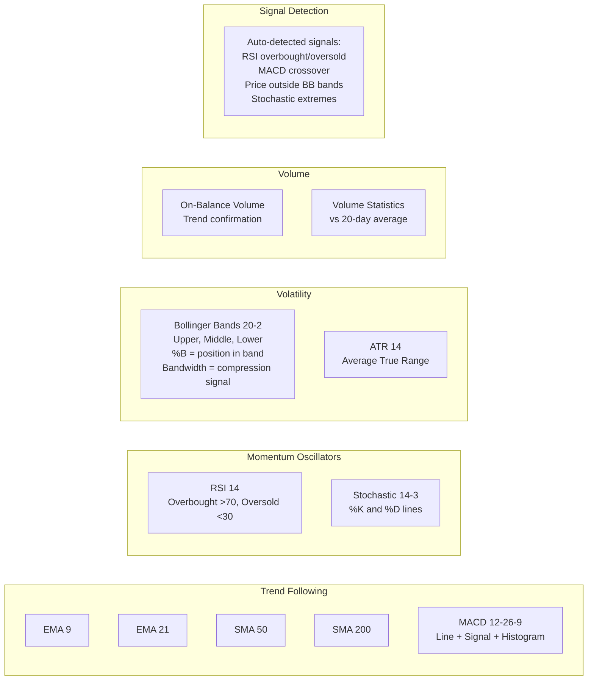
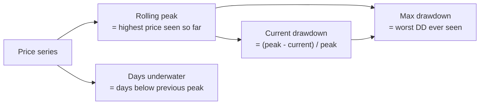
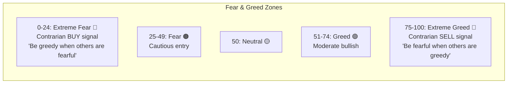
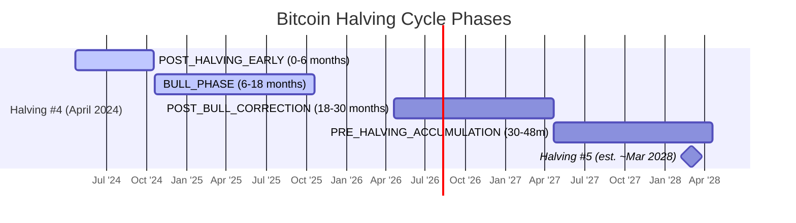
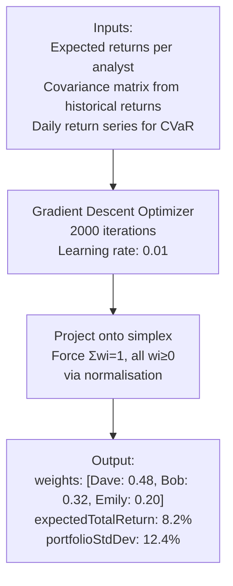
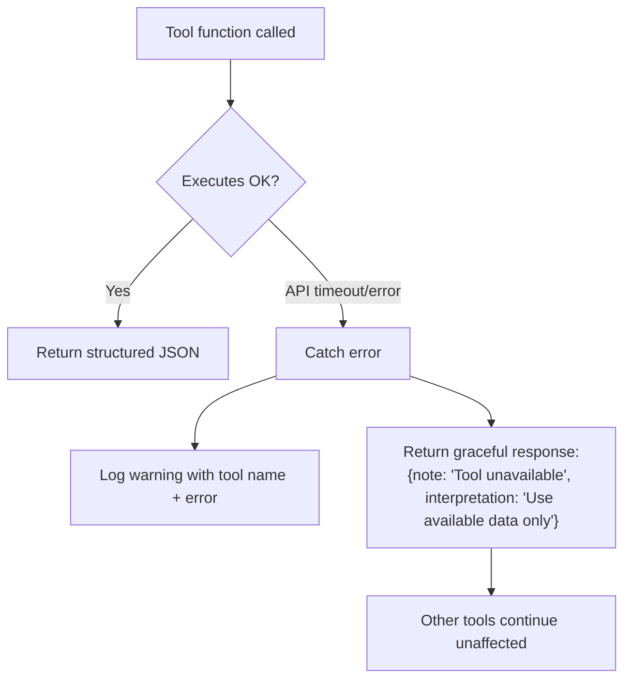

# Chapter 5 — The Tool System

## What Are Tools?

Tools are **deterministic data-to-insight functions**. They take OHLCV price data + context and return structured JSON that the LLM can reason about. They are the agent's analytical instruments — analogous to a trader's Bloomberg terminal.

**Key design principle:** Tools never call the LLM. They are pure computation. This keeps costs down (no wasted tokens on computations) and makes results reproducible and verifiable.

---

## Tool Architecture

```mermaid
graph TD
    AGENT[Agent Tick] --> REGISTRY[Tool Registry<br/>src/tools/registry.cjs]

    REGISTRY --> PERMITTED{Only tools listed<br/>in agent's XML profile}

    PERMITTED --> PARALLEL[Run all permitted tools<br/>in parallel via Promise.allSettled]

    subgraph TECH["src/tools/technical.cjs"]
        T1[technicalIndicators]
        T2[trendAnalysis]
        T3[supportResistance]
        T4[volumeAnalysis]
        T5[volatilityRegime]
        T6[drawdownAnalysis]
    end

    subgraph RISK["src/tools/risk.cjs"]
        R1[riskMetrics]
        R2[stressTester]
        R3[portfolioOptimizer]
    end

    subgraph DOM["src/tools/domain.cjs"]
        D1[blockchainMetrics]
        D2[cryptoSentiment]
        D3[regulatoryScanner]
        D4[halvingCycleAnalysis]
        D5[earningsCalendar]
        D6[fundamentalValuation]
        D7[sectorRotation]
        D8[centralBankMonitor]
        D9[interestRateDifferential]
        D10[geopoliticalRisk]
        D11[macroEconomicCalendar]
    end

    PARALLEL --> TECH
    PARALLEL --> RISK
    PARALLEL --> DOM

    TECH & RISK & DOM --> MERGE[Merge all results<br/>{ toolName: result, ... }]
    MERGE --> LLM[Passed to decision prompt]
```

---

## Tool Context Object

Every tool receives a **context object** with:

```javascript
const ctx = {
    ohlcv: {
        opens:   [44800, 45100, 45200, ...],   // Price array
        highs:   [45500, 45600, 45300, ...],
        lows:    [44600, 44900, 45000, ...],
        closes:  [45100, 45200, 45300, ...],   // Adjusted close
        volumes: [1200000, 980000, 1450000, ...],
        dates:   ['2024-01-10', '2024-01-11', ...]
    },
    news:          ['Bitcoin ETF sees $2B inflows...', ...],  // Headlines
    symbol:        'BTC-USD',
    portfolioState: { ... },    // Current portfolio snapshot
    allAssetData:  { Dave: ohlcv, Bob: ohlcv, Emily: ohlcv },  // All agents (Otto only)
    config:        { riskFreeRate: 0.02, cvarConfidence: 0.95 }
};
```

---

## Universal Tools (All Agents)

### 1. `technicalIndicators` — The Master Technical Summary

The most comprehensive tool. Runs ALL technical indicators and returns a unified object.

**Indicators computed:**



**Sample output:**
```json
{
    "currentPrice": 45200,
    "dailyChangePct": 1.34,
    "rsi": 63.2,
    "macd": { "macdLine": 142, "signalLine": 98, "histogram": 44 },
    "bollingerBands": { "upper": 47800, "middle": 44200, "lower": 40600, "pctB": 0.65 },
    "atr": 1240,
    "stochastic": { "k": 71.3, "d": 68.5 },
    "trend": { "direction": "BULLISH", "strength": 0.75, "ema9": 44900 },
    "volatilityRegime": { "regime": "HIGH", "annualisedVolPct": 58.3 },
    "signals": [{ "indicator": "MACD", "signal": "BULLISH_CROSSOVER", "value": 44 }],
    "signalSummary": "MACD: BULLISH_CROSSOVER (44)"
}
```

---

### 2. `riskMetrics` — Portfolio Risk Assessment

```mermaid
graph LR
    RETURNS[Daily Returns Array] --> CALC

    subgraph CALC["Risk Calculations"]
        TR[Total Return<br/>compounded product]
        ARR[Annualised Return<br/>geometric annualisation]
        SR[Sharpe Ratio<br/>excess return / vol]
        SOR[Sortino Ratio<br/>excess return / downside std]
        MDD[Max Drawdown<br/>peak-to-trough]
        CR[Calmar Ratio<br/>ARR / MDD]
        VAR[VaR 95%<br/>historical simulation]
        CVAR[CVaR 95%<br/>expected shortfall]
        VOL[Annualised Vol<br/>√252 × daily std]
    end

    CALC --> OUT["Output includes interpretation:<br/>'Negative Sharpe — not compensating for risk'<br/>'High volatility (>40%)' etc."]
```



**Implementation detail — guard against floating point zero:**

All ratios guard against near-zero denominator:
```javascript
if (vol < 1e-10) return 0; // Guard against floating-point near-zero vol
```

---

### 3. `newsAnalysis`

Passes headlines through to the LLM as-is. The LLM (in the decision prompt) performs the actual sentiment analysis — the tool just ensures news is structured and capped at 10 headlines.

**Why not sentiment-score in the tool?** 

Sentiment scoring requires language understanding that LLMs do better than simple keyword matching. The decision prompt provides full context (agent persona + market state) for nuanced interpretation.

---

### 4. `volatilityRegime`

Categorises the current market environment:

| Vol Level | Annual Vol | Meaning |
|-----------|-----------|---------|
| LOW | < 15% | Calm market, strategies work as expected |
| MEDIUM | 15-30% | Normal conditions |
| HIGH | 30-50% | Elevated risk, reduce position sizes |
| EXTREME | > 50% | Crisis conditions, capital preservation mode |

---

### 5. `supportResistance`

Identifies key price levels:

```javascript
// 20-day lookback
resistance = max(highs[-20:])   // Upper bound (selling pressure)
support    = min(lows[-20:])    // Lower bound (buying pressure)

// Where is current price within this range?
positionPct = (current - support) / (resistance - support) * 100
nearResistance = (resistance - current) / range < 0.10  // Within 10% of top
nearSupport    = (current - support)    / range < 0.10  // Within 10% of bottom
```

---

### 6. `drawdownAnalysis`



---

## Bitcoin-Specific Tools (Dave Only)

### 7. `blockchainMetrics`

Fetches real on-chain data from [api.blockchain.info](https://api.blockchain.info/stats) (free, no API key):

| Metric | Significance |
|--------|-------------|
| Hash rate (EH/s) | Miner confidence — falling hash rate = miners quitting = bearish |
| Difficulty | Network security, adjusts every 2016 blocks |
| Mempool size | Congestion indicator — large mempool = high demand |
| Minutes between blocks | Health check — should be ~10 min |
| Total BTC mined | Current circulating supply proxy |

---

### 8. `cryptoSentiment` — Fear & Greed Index

Fetches from [api.alternative.me/fng](https://api.alternative.me/fng/?limit=7) (free):



The tool returns current value, label, and week-ago comparison to show trend direction.

---

### 9. `halvingCycleAnalysis`

Bitcoin's supply issuance halves every 210,000 blocks (~4 years). Historical pattern:



**Cycle phase informs strategy:**
- `POST_HALVING_EARLY`: Conservative entry — trend not yet confirmed
- `BULL_PHASE`: Bullish bias — momentum trades, wider stop-losses
- `POST_BULL_CORRECTION`: Reduce longs, protect gains
- `PRE_HALVING_ACCUMULATION`: Gradual accumulation zone

---

### 10. `regulatoryScanner`

Scans news headlines for regulatory risk keywords:

```
Keywords: regulation, ban, SEC, CFTC, illegal, crackdown, 
          approved, ETF, license, compliance
```

Returns risk level: LOW (0 matches), MEDIUM (1-2), HIGH (3+)

---

## Equities-Specific Tools (Bob Only)

### 11. `fundamentalValuation`

Uses 52-week high/low position as a proxy for valuation:

```
positionIn52wk = (current - yearLow) / (yearHigh - yearLow) × 100%

> 80%: "Near 52-week high — caution on valuation"
< 20%: "Near 52-week low — potential value opportunity"
```

*Production note: Full DCF / P/E analysis would require a financial data API (Alpaca, Polygon, etc.).*

---

## Forex-Specific Tools (Emily Only)

### 12. `interestRateDifferential`

Maintains hardcoded current central bank rates per currency:

```javascript
const rates = {
    USD: 5.375, EUR: 4.50, GBP: 5.25,
    JPY: -0.10, CHF: 1.75, AUD: 4.35, NZD: 5.50
};
```

For EURUSD=X: `differential = USD_rate - EUR_rate = 5.375 - 4.50 = 0.875%`

Positive differential = carry trade favours USD long (bearish EUR/USD).

---

### 13. `centralBankMonitor`

Returns upcoming central bank meeting dates with rate expectations. Agents reduce position size before major central bank decisions to avoid binary event risk.

---

### 14. `geopoliticalRisk`

Scans headlines for geopolitical keywords:
```
war, sanctions, conflict, invasion, NATO, geopolitical, 
tensions, election, coup, crisis
```

FX markets are particularly sensitive to European political risk (EUR/USD weakens on EU political instability).

---

## Portfolio-Level Tools (Otto Only)

### 15. `portfolioOptimizer`

The crown jewel of Otto's toolkit. Solves the mean-variance optimisation problem from the paper:

```
maximize: Σ ωi·ρi - λ1·σp² - λ2·CVaR
subject to: Σωi = 1, all ωi ≥ 0
```

Where:
- `ωi` = weight allocated to analyst i
- `ρi` = predicted return (from BAC reports)
- `σp²` = portfolio variance
- `CVaR` = Conditional Value at Risk (95%)
- `λ1` = risk aversion for variance (default: 0.5)
- `λ2` = risk aversion for tail risk (default: 0.3)



**Covariance matrix captures cross-asset correlations:**

```
           BTC    DJI    FX
BTC    [  0.85   0.12   0.03 ]
DJI    [  0.12   0.18   0.05 ]
FX     [  0.03   0.05   0.04 ]
```

Low BTC-FX correlation = good diversification. If BTC crashes, FX is less affected.

---

### 16. `stressTester`

Simulates portfolio under predefined shock scenarios:

| Scenario | Shock Applied |
|----------|-------------|
| Bear Market | All assets -30% |
| Crypto Crash | BTC -50%, others -10% |
| Market Flash Crash | All assets -10% |
| Rate Spike | DJI -15%, FX -5%, BTC -5% |
| Mild Correction | All assets -10% |

Returns portfolio value and P&L for each scenario, helping Otto assess downside risk before the BAC.

---

## Tool Error Handling



The registry uses `Promise.allSettled()` — a failed tool produces an error entry in `_errors` but never crashes the system.

---

## Adding Custom Tools

To add a new tool for a custom domain:

**1. Implement in `src/tools/domain.cjs`:**
```javascript
async function getMyCustomTool(ctx) {
    const { ohlcv, news, symbol } = ctx;
    // Your analysis logic here
    return {
        myMetric: 42,
        interpretation: 'Human-readable explanation for the LLM'
    };
}
module.exports = { ..., getMyCustomTool };
```

**2. Register in `src/tools/registry.cjs`:**
```javascript
const TOOLS = {
    ...,
    myCustomTool: async (ctx) => domain.getMyCustomTool(ctx),
};
```

**3. Add to agent profile XML:**
```xml
<toolPermissions>
    <tool>myCustomTool</tool>
</toolPermissions>
```

That's all. The registry automatically dispatches it.
