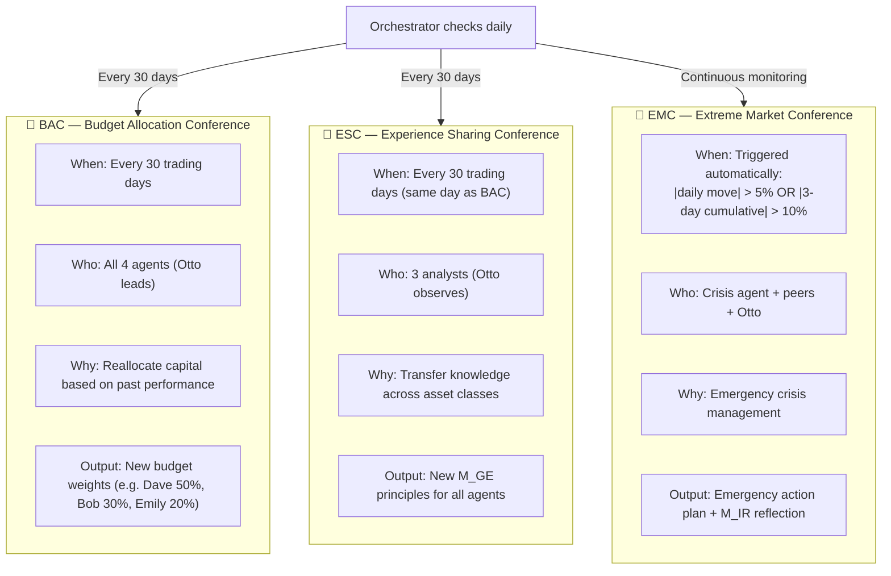
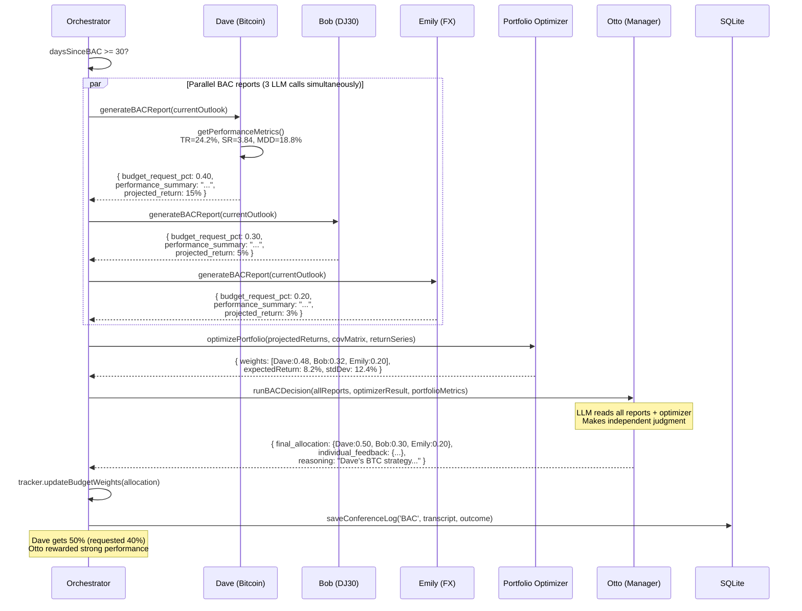
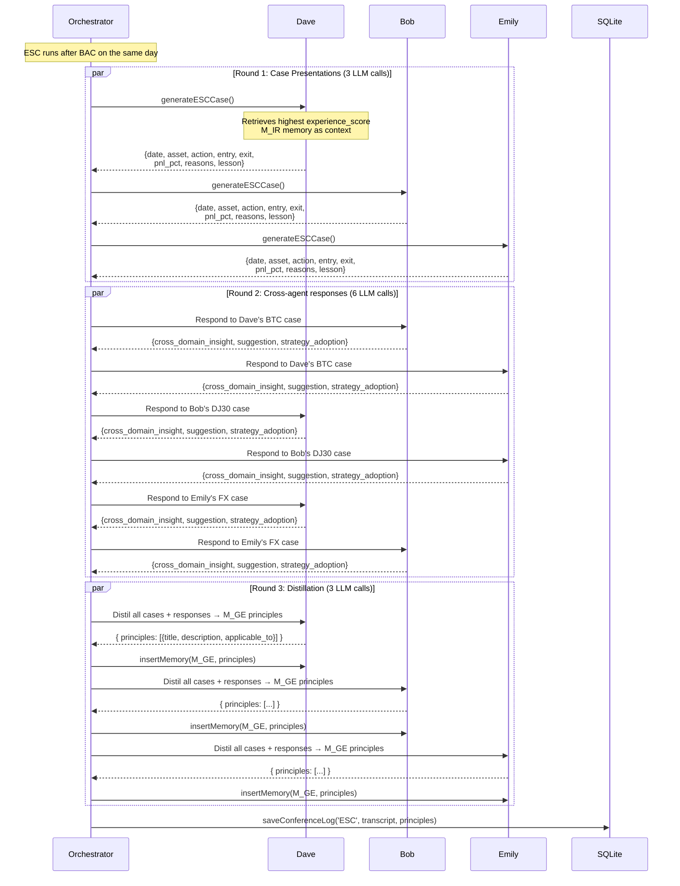
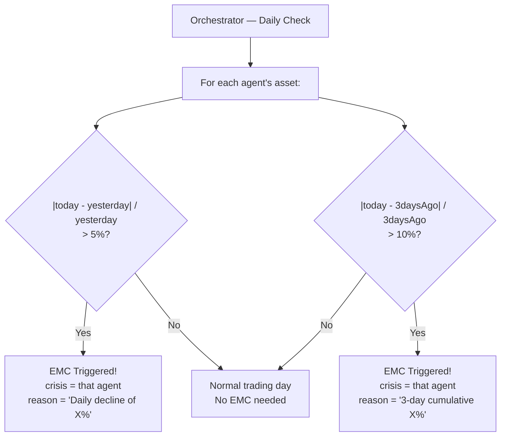

# Chapter 6 — The Conference System

## What Are Conferences?

Conferences are **structured multi-agent conversations** — moments where the agents stop operating independently and collaborate as a team. They are the mechanism through which individual agent knowledge becomes collective team intelligence.

There are three types, each triggered differently and serving a different purpose:



---

## Conference 1: Budget Allocation Conference (BAC)

### Purpose

The BAC is how HedgeAgents **learns which analysts are performing best** and rebalances capital accordingly. An analyst who has been consistently profitable for 30 days gets more capital to work with. An underperformer gets less.

This is more sophisticated than simple performance chasing — Otto runs a **portfolio optimizer** that considers the correlation between assets (you don't want to over-weight two correlated assets) and the risk profile of each analyst's strategy.

### Full Flow



### What Each Agent Reports

The BAC report from each analyst contains:
- **Performance metrics**: TR, SR, MDD, Vol, CR, SoR for the past 30 days
- **Strengths**: What worked in their strategy
- **Weaknesses**: What didn't work
- **Market outlook**: Their view on the next 30 days for their asset
- **Budget request**: The fraction they're asking for
- **Justification**: Why they deserve it
- **Projected return**: Their expected return for next cycle

### Otto's Decision Process

Otto doesn't just rubber-stamp the optimizer. He:

1. Reads all three analyst reports
2. Sees the mathematical optimal weights
3. Considers qualitative factors (risk sentiment, upcoming macro events, market outlook)
4. **Can deviate from the optimizer** with explicit reasoning
5. Issues feedback to each analyst about their performance and strategy

Example: Even if the optimizer says Dave should get 55%, Otto might override to 45% if he sees elevated crypto regulatory risk in the news, despite Dave's strong numbers.

### The Portfolio Optimization Math

The objective function maximised:

```
Objective = Σ ωi·ρi − λ1·σp² − λ2·CVaR(95%)

Where:
  ωi = weight for analyst i
  ρi = projected annual return from analyst i's BAC report
  σp² = portfolio variance = ωᵀ Σ ω (where Σ is covariance matrix)
  CVaR = expected loss beyond the 95th percentile worst day

Constraints:
  Σωi = 1 (fully invested)
  ωi ≥ 0 (no short-selling of analyst budgets)
```

Solved via **projected gradient descent** (2000 iterations, learning rate 0.01) — pure JavaScript, no native dependencies.

---

## Conference 2: Experience Sharing Conference (ESC)

### Purpose

The ESC is HedgeAgents' **knowledge transfer mechanism**. Each analyst operates in a silo during normal trading days — Dave sees only Bitcoin, Bob sees only DJ30. The ESC breaks these silos.

Dave might have discovered that "when the US 10-year yield spikes, Bitcoin drops within 48 hours." This is useful for Bob and Emily too. The ESC extracts and shares these cross-domain insights.

### Full Flow



### Example ESC Interaction

**Dave presents:**
> "I bought Bitcoin at $28,194 on April 3, 2023. The ADL was diverging and Stochastic entered oversold. Sold at $30,382 on April 18 (RSI crossed 70 with divergence, F&G at peak). Profit: 7.7%."

**Bob responds (cross-domain):**
> "Dave's case highlights the power of divergence indicators. In DJ30, I often ignore ADL divergences as equities tend to have persistent trends. I should incorporate divergence checks before major exits. Cross-domain learning: indicator divergences are reliable exit signals across all asset classes."

**Emily responds:**
> "Dave's disciplined entry timing (waiting for oversold + divergence) mirrors what I do with RSI + MACD in FX. I'll specifically adopt his F&G index as a supplementary sentiment layer for EUR/USD — when US crypto sentiment peaks, it often correlates with USD risk appetite changes."

**Final distillation (stored in M_GE for all 3 agents):**
> **Principle: "Sentiment Peaks as Cross-Asset Exit Signals"**
> When market sentiment indicators (Fear & Greed, VIX, put/call ratio) reach extreme levels, this frequently signals regime change across ALL asset classes — not just the one being monitored. Integrate sentiment extremes as mandatory check before holding through suspected peaks.

---

## Conference 3: Extreme Market Conference (EMC)

### Trigger Logic



The EMC runs **before** analyst ticks on the day it's triggered. This ensures the crisis response influences that day's trading decisions.

### Full Flow

```mermaid
sequenceDiagram
    participant ORCH as Orchestrator
    participant CRISIS as Crisis Agent (e.g. Dave)
    participant PEER1 as Peer 1 (Bob)
    participant PEER2 as Peer 2 (Emily)
    participant OTTO as Otto
    participant DB as SQLite

    ORCH->>CRISIS: EMC triggered — present your situation

    CRISIS->>ORCH: crisisPresentation = {
        current_holdings: "56.8% BTC, 43.2% cash",
        loss_reasons: ["Fed balance sheet reduction", "Market correction", "Volatility spike"],
        proposed_action: "Sell all BTC immediately"
    }

    par Peer suggestions (2 LLM calls)
        ORCH->>PEER1: Read crisis presentation. Suggest action.
        PEER1-->>ORCH: { suggested_action: "Buy more",
            stance: "aggressive",
            rationale: "Market has bottomed, buy the dip" }

        ORCH->>PEER2: Read crisis presentation. Suggest action.
        PEER2-->>ORCH: { suggested_action: "Hold",
            stance: "conservative",
            rationale: "High volatility, wait for clearer signals" }
    end

    ORCH->>OTTO: Synthesise: crisis + peer suggestions + portfolio metrics
    Note over OTTO: λ3 = 0.4 (weight of conservative/protective view)
    OTTO-->>ORCH: { balanced_recommendation: "Wait-and-see",
        recommended_action: "Hold",
        trigger_conditions: {
            take_profit_pct: 0.05,  ← Sell if +5% recovery
            stop_loss_pct: 0.05,    ← Sell if -5% further decline
            review_in_days: 3
        },
        rationale: "Don't panic-sell, but protect with clear triggers" }

    ORCH->>CRISIS: Receive Otto's guidance + peer suggestions. Make final decision.
    CRISIS-->>ORCH: { final_action: "Hold",
        trigger_conditions: { take_profit: 0.08, stop_loss: 0.08 },
        execution_plan: "Monitor hourly, execute triggers automatically" }

    ORCH->>DB: saveConferenceLog('EMC', fullTranscript, finalDecision)
    CRISIS->>DB: insertMemory(M_IR, emcReflection)
```

### The λ3 Synthesis Formula

Otto's guidance weights between peer suggestions and a protective stance:

```
Otto_guidance = (1 − λ3) × blend(peer suggestions) + λ3 × conservative_protection
```

At `λ3 = 0.4`:
- 60% weight on peer consensus (Bob + Emily's combined view)
- 40% weight on conservative protection (capital preservation)

This prevents both:
- **Panic-selling** (acting on the most bearish peer suggestion)
- **Doubling down** (acting on the most aggressive peer suggestion)

### Real Paper Example

From the paper: Dave's portfolio in April 2021 suffered losses when BTC fell sharply. EMC was triggered.

- Bob (aggressive): "Market has bottomed — buy more BTC"
- Emily (conservative): "Too volatile — maintain current position, wait for signals"
- Otto (balanced): "Monitor closely. If price recovers +5% above current, begin selling. If price falls -5% further, liquidate immediately."

Dave adopted a modified version: +8% → sell, -8% → liquidate.

**Result:** BTC rose 12.4% over the next few days, and Dave liquidated for a +6.2% gain on total assets. The EMC turned a potential panic-sell into a patient, profitable exit.

---

## Conference Cost Summary

| Conference | LLM Calls | Approx Tokens In | Approx Tokens Out | Frequency |
|------------|-----------|-----------------|------------------|-----------|
| BAC | 4 (3 reports + 1 decision) | ~5,000 | ~1,500 | Every 30 days |
| ESC | 12 (3 cases + 6 responses + 3 distillations) | ~10,000 | ~3,000 | Every 30 days |
| EMC | 5 (1 crisis + 2 peers + 1 Otto + 1 final) | ~4,000 | ~2,000 | 0-5 per 30 days |
| **Per cycle** | **16-21 calls** | **~19,000** | **~6,500** | Per 30-day cycle |

---

## Conference Log Format

All conferences are logged to SQLite for audit and review:

```json
{
  "type": "BAC",
  "timestamp": 1772000000,
  "transcript": {
    "reports": {
      "Dave": { "budget_request_pct": 0.40, "tr": 24.2, "sr": 3.84, ... },
      "Bob":  { "budget_request_pct": 0.30, "tr": 1.91, "sr": 1.38, ... },
      "Emily":{ "budget_request_pct": 0.20, "tr": 0.43, "sr": 0.87, ... }
    },
    "optimizerResult": { "weights": { "Dave": 0.48, "Bob": 0.32, "Emily": 0.20 }, ... },
    "ottoDecision": { "final_allocation": { "Dave": 0.50, "Bob": 0.30, "Emily": 0.20 }, ... }
  },
  "outcome": {
    "allocation": { "Dave": 0.50, "Bob": 0.30, "Emily": 0.20 }
  }
}
```

Query conference history:
```javascript
const logs = memStore.getConferenceLogs('BAC', 10); // Last 10 BAC logs
```
