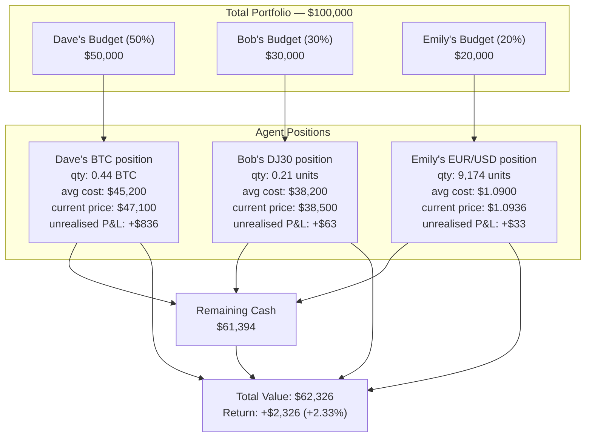
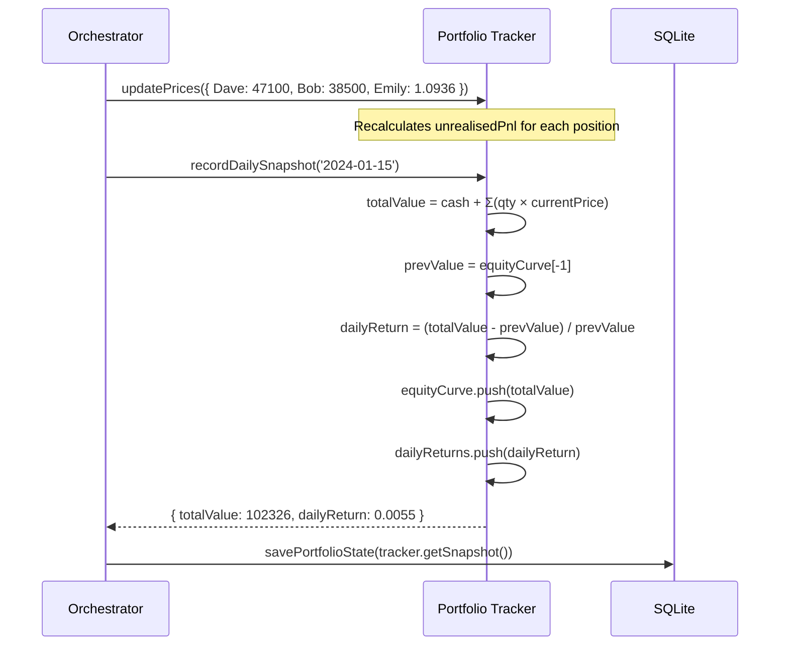
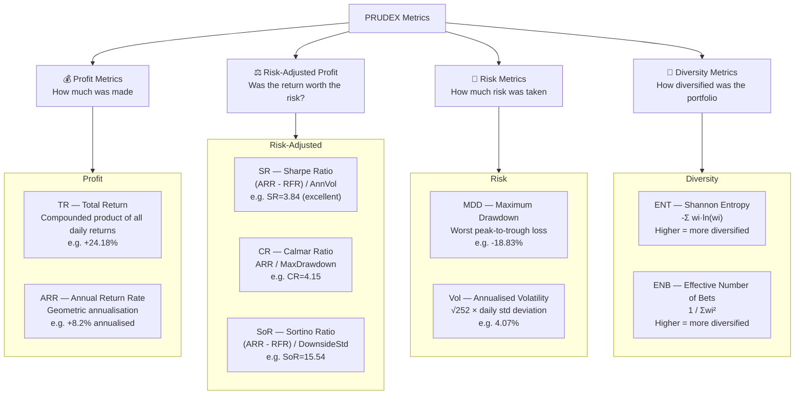
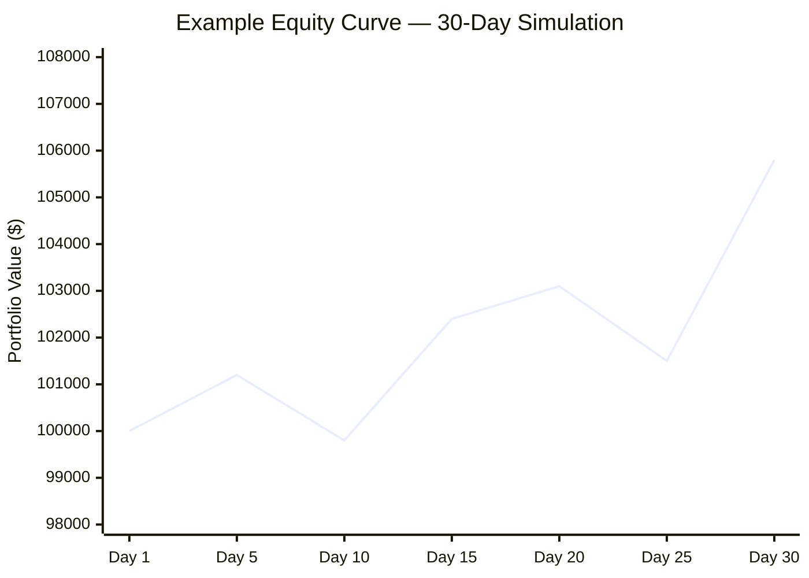
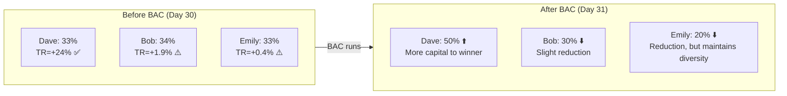

# Chapter 7 — Portfolio System & PRUDEX Metrics

## Portfolio Architecture

HedgeAgents uses a **unified portfolio** shared across all agents, but with **budget weight partitioning** — each analyst controls a fraction of the total capital as assigned by Otto after each BAC.



---

## Portfolio Tracker: Core Concepts

### Budget Weights vs Position Size

These are two different things:

| Concept | Definition | Updated by |
|---------|-----------|-----------|
| **Budget weight** | What fraction of total portfolio Otto has assigned to this analyst | Otto after each BAC |
| **Available cash** | Agent's budget minus their current position value | Real-time |
| **Position size** | Actual deployed capital in the asset | After each trade execution |

```javascript
// Analyst's total budget
agentBudget = totalPortfolioValue × budgetWeight

// Available to deploy right now
availableCash = agentBudget - (positionQty × currentPrice)

// If Dave has $50k budget, $20k in BTC:
// availableCash = $50,000 - $20,000 = $30,000
// If Dave decides to Buy with quantity_pct=0.30:
// tradeCost = $30,000 × 0.30 = $9,000
```

### Trade Execution Logic

```mermaid
flowchart TD
    INPUT["executeAction(agentName, decision, price, date)"]

    INPUT --> BUY_CHECK{action == 'Buy'<br/>AND qty_pct > 0<br/>AND availableCash > $10?}
    INPUT --> SELL_CHECK{action == 'Sell'<br/>AND position > 0?}
    INPUT --> HOLD_CHECK{action == 'Hold' or<br/>SetTradingConditions etc.?}

    BUY_CHECK -->|Yes| BUY_CALC["tradeCost = availableCash × qty_pct<br/>tradeQty = tradeCost / price<br/>Update: qty += tradeQty<br/>avgCost = weighted average<br/>cash -= tradeCost"]

    SELL_CHECK -->|Yes| SELL_CALC["sellFraction = qty_pct (or 1.0 for full exit)<br/>proceeds = tradeQty × price<br/>realisedPnL = proceeds - (tradeQty × avgCost)<br/>qty -= tradeQty<br/>cash += proceeds"]

    HOLD_CHECK -->|Yes| HOLD_LOG["Acknowledge decision<br/>No position change<br/>Still logged in trades"]

    BUY_CALC & SELL_CALC & HOLD_LOG --> LOG[Store in trades array:<br/>{ date, agentName, action, price,<br/>tradeQty, tradeCost, stopLoss, takeProfit }]
```

### Stop-Loss / Take-Profit Monitoring

Every Buy trade stores the agent's stated stop-loss and take-profit levels. Otto (or the orchestrator) monitors these:

```javascript
// Check trigger conditions daily
const triggers = portfolio.checkTriggerConditions(currentPrices);
// Returns: [{ agentName: 'Dave', reason: 'TAKE_PROFIT', price: 49500, pnlPct: 0.0951 }]
```

When triggered, the orchestrator automatically executes a Sell action, even without an LLM call.

---

## Price Updates and Daily Snapshots



---

## PRUDEX: The 9 Performance Metrics

PRUDEX is the evaluation framework from the HedgeAgents paper. It measures performance across three dimensions:



### Metric Formulas

**Total Return (TR):**
```
TR = ∏(1 + ri) − 1
   = (1 + r1)(1 + r2)...(1 + rN) − 1
```

**Annual Return Rate (ARR):**
```
ARR = TR^(252/N) − 1
```
Where N = number of trading days.

**Sharpe Ratio (SR):**
```
SR = (ARR − RFR) / AnnVol
```
Where RFR = risk-free rate (default: 2%), AnnVol = √252 × std(daily returns)

**Sortino Ratio (SoR):**
```
SoR = (ARR − RFR) / DownsideDeviation
```
Where DownsideDeviation only counts returns below the risk-free rate.

**Calmar Ratio (CR):**
```
CR = ARR / MaxDrawdown
```

**Maximum Drawdown (MDD):**
```
MDD = max over all t: (peak_t − current_t) / peak_t
```

**Shannon Entropy (ENT):**
```
ENT = −Σ wi · ln(wi)
```
For equal weights [0.33, 0.33, 0.34]: ENT ≈ 1.10 (maximum for 3 assets)
For concentrated [0.90, 0.05, 0.05]: ENT ≈ 0.39 (low diversity)

**Effective Number of Bets (ENB):**
```
ENB = 1 / Σwi²
```
For equal weights: ENB = 1/3 × (1/0.11) = 3.0 (3 independent bets)
For concentrated [0.90, 0.05, 0.05]: ENB = 1/(0.81+0.0025+0.0025) ≈ 1.22 (barely diversified)

---

### Metric Benchmarks (From the Paper)

The original paper showed these metrics over their 3-year backtest:

| Agent | TR | SR | MDD | Vol | CR | SoR |
|-------|----|----|-----|-----|----|----|
| Dave (BTC) | **24.18%** | 3.84 | 18.83% | 4.07% | 4.15 | **15.54** |
| Bob (DJ30) | 1.91% | 1.38 | 3.76% | 0.95% | 1.74 | 5.22 |
| Emily (FX) | 0.43% | 0.87 | 1.07% | 0.33% | 1.33 | 3.55 |
| **Portfolio** | **12.75%** | **3.54** | **10.07%** | **2.34%** | **4.11** | **14.75** |

Portfolio metrics are better than any single agent because of diversification (low correlation between BTC, DJI, FX).

---

## The Equity Curve

The equity curve is the most visual representation of performance — it shows portfolio value over time:



The orchestrator records equity curve via `tracker.recordDailySnapshot()` and writes the final curve to `tests/e2e/output/equity-curve-<timestamp>.csv` after a backtest.

---

## Budget Weight Impact

The BAC's power becomes clear when you look at how budget weights affect outcomes:



The rebalancing effect: if Dave continues performing, his 50% weight amplifies returns. If he underperforms next cycle, the next BAC will reduce his weight.

---

## Reading the PRUDEX Table

At end of simulation, the system prints:

```
═══════════════════════════════════════════════
SIMULATION COMPLETE — PRUDEX METRICS
═══════════════════════════════════════════════

Metric                  Value    Category
─────────────────────   ───────  ────────────
Total Return (TR)        +8.24%  Profit
Annual Return (ARR)      +8.24%  Profit
Sharpe Ratio (SR)        2.1812  Risk-Adjusted
Calmar Ratio (CR)        4.3     Risk-Adjusted
Sortino Ratio (SoR)      3.8921  Risk-Adjusted
Max Drawdown (MDD)       1.91%   Risk
Volatility (Vol)         3.82%   Risk
Entropy (ENT)            1.0889  Diversity
Eff. Num. Bets (ENB)     2.9412  Diversity

✅ Total return: +8.24% | ✅ Sharpe 2.18 (excellent) | ✅ Max drawdown 1.91% (well controlled)
```

**Interpreting key ratios:**

| Ratio | < 0 | 0–1 | 1–2 | 2+ |
|-------|-----|-----|-----|----|
| **Sharpe** | Losing relative to risk | Poor | Acceptable | Excellent |
| **Calmar** | — | Drawdown > annual return | OK | Good |
| **Sortino** | — | Poor downside management | OK | Good |
| **ENB** | — | 1-1.5: Concentrated | 1.5-2.5: Moderate | 2.5+: Diversified |
