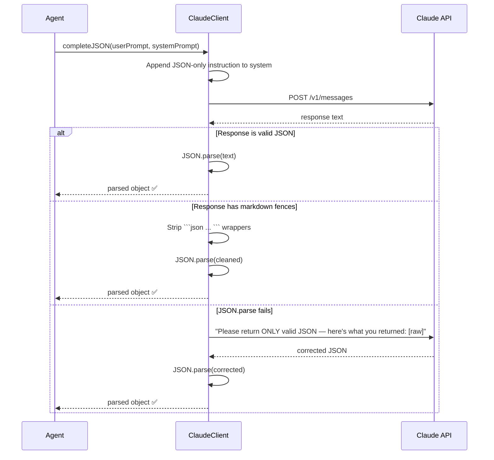

# Chapter 8 — LLM Client & Prompt Engineering

## The Claude Client

HedgeAgents communicates with Claude Sonnet 4.6 via a **pure HTTPS implementation** — no SDK, no external LLM library. This is the same pattern used in BrewBoard.

```mermaid
graph LR
    CALLER[Any Agent / Conference] --> CLIENT[ClaudeClient<br/>src/llm/claude-client.cjs]
    CLIENT --> API[POST api.anthropic.com/v1/messages<br/>HTTPS — pure Node.js]
    API --> RESPONSE[{ content: [{ text: '...' }],<br/>usage: { input_tokens, output_tokens } }]
    RESPONSE --> CLIENT
    CLIENT --> CALLER
```

### Client Capabilities

| Method | Purpose | Returns |
|--------|---------|---------|
| `complete(user, system, maxTokens)` | Single-turn with system prompt | `{ text, inputTokens, outputTokens }` |
| `completeJSON(user, system, maxTokens)` | Single-turn + enforce JSON output | Parsed JS object |
| `converse(messages[], system, maxTokens)` | Multi-turn conversation | `{ text, ... }` |
| `converseJSON(messages[], system, maxTokens)` | Multi-turn + enforce JSON | Parsed JS object |

### JSON Enforcement

All structured responses use `completeJSON` or `converseJSON`. These methods:

1. Append to system prompt: `"Your response MUST be valid JSON only. No markdown, no code fences, no explanatory text — pure JSON object."`
2. Strip markdown code fences if Claude includes them anyway
3. If JSON parse fails → send a correction prompt asking Claude to try again
4. Works in 99.9% of cases with Claude Sonnet 4.6



### Rate Limit Handling

```javascript
// Auto-retry on 429 (rate limit) with exponential backoff
if (err.statusCode === 429 && attempt < this._maxRetries) {
    attempt++;
    await sleep(this._retryDelayMs * attempt); // 5s, 10s, 15s
}
```

Default: 3 retries, 5 second base delay.

---

## Multi-Turn Conversations (Conferences)

Conferences require **multi-turn message histories** — the BAC, ESC, and EMC involve sequential exchanges where each agent sees what was said before.

```mermaid
sequenceDiagram
    participant CLIENT as ClaudeClient
    participant CLAUDE as Claude

    Note over CLIENT: Start a conference conversation

    CLIENT->>CLAUDE: messages = [
        { role: 'user', content: 'Dave, present your BAC report...' }
    ]
    CLAUDE-->>CLIENT: { role: 'assistant', content: '{ "budget_request_pct": 0.40, ... }' }

    Note over CLIENT: Append to history and continue

    CLIENT->>CLAUDE: messages = [
        { role: 'user', content: 'Dave BAC report...' },
        { role: 'assistant', content: 'Dave response' },
        { role: 'user', content: 'Bob, now your BAC report...' }
    ]
    CLAUDE-->>CLIENT: Bob response

    Note over CLIENT: Otto sees all exchanges in context
```

This gives conferences **conversational coherence** — Otto makes his BAC decision having "read" all analyst reports in the same context window.

---

## The 12 Prompt Templates

All prompts live in `src/llm/prompt-builder.cjs`. Each returns `{ system, user }` objects.

### Template 1: Summarized Query Qt

**Purpose:** Condense current market state into a retrieval query.

**System:** Agent's profile description + "You are generating a concise query to search your memory bank."

**User:**
```
## Current Market Situation — {date}
Asset: {assetLabel}
Current Prices: {prices}
Recent News: {headlines}
Key Indicators: {technicalIndicators summary}

## Task
In 2-3 sentences, summarise the current market conditions and key driving factors.
This will be used to search your memory for similar past situations.
Respond with ONLY the summary text (no JSON).
```

**Typical output:** 
> "Bitcoin is demonstrating bullish momentum, with RSI at 63 and Fear & Greed at 62, driven by ETF inflows and institutional demand. Macroeconomic conditions are supportive with the Fed expected to pause rate hikes."

---

### Template 2: Investment Decision

**Purpose:** The main decision-making prompt.

**System:** Full agent profile description.

**User structure:**
```
## Market Environment — {date}
Asset / Current Price / Open / High / Low / Previous Close

## Recent News
{10 headlines}

## Technical Analysis Results
{all tool results — JSON formatted}

## Your Portfolio Position
{current position, cash, unrealised P&L}

## Retrieved Experience (Top 5 similar situations)
[Memory 1] (M_MI, 2024-01-15)
{market snapshot from that date}

[Memory 2] (M_IR, 2024-01-18)
{reflection: "Bought at $43k, gained 7%, lesson: ..."}

...

## Decision Task
{JSON schema: action, quantity_pct, rationale, risk_level, stop_loss_pct, take_profit_pct, confidence}
```

**Why this structure matters:**
- Tool results come BEFORE memories — the LLM grounds in current facts first
- Memories are labelled with type and date — the LLM can assess recency
- Portfolio state shows what's already deployed — prevents over-concentration
- JSON schema at the end ensures structured output

---

### Template 3: Reflection

**Purpose:** Post-trade lesson extraction.

**User:**
```
## Previous Decision ({date})
Action: {Buy/Sell/Hold} at {price}
Rationale: {original_rationale}
Risk assessed: {low/medium/high}

## Outcome ({N} days later)
Price now: {currentPrice}
P&L: {+/-X.XX%}
Portfolio change: {+/-Y.YY%}

## Task
Reflect on this trade. What did you learn?
{JSON schema: outcome_assessment, what_worked, what_failed, lesson, strategy_update, experience_score}
```

The `experience_score` (0-1) the LLM assigns determines how likely this memory is to surface in future ESC case selection.

---

### Template 4 & 5: BAC Report + Decision

The BAC prompts work as a two-phase exchange:

**Phase 1 (Analyst → Manager):** Each analyst gets their performance metrics and is asked to justify a budget allocation. The prompt explicitly shows their TR, SR, MDD, Vol, CR, SoR numbers.

**Phase 2 (Manager decision):** Otto receives all three analyst reports, the portfolio optimizer output, and must decide final allocation. He's explicitly allowed to deviate from the optimizer.

**Key tension in Otto's prompt:** "You may deviate from the mathematical optimum with good reason." This forces Otto to think critically rather than just accepting the math.

---

### Templates 6-8: ESC Suite

Three connected prompts for the three rounds of ESC:

**Case presentation (T6):** Agent presents their most instructive trade — entry, exit, reasons, outcome, lesson. Structured to be peer-reviewable.

**Peer response (T7):** Other agents respond to a case they didn't trade. Critically: they're asked "What parallels exist in YOUR own market?" This forces genuine cross-domain translation.

**Distillation (T8):** After all exchanges, each agent synthesises 3-5 generalizable principles. These go directly into M_GE.

---

### Templates 9-12: EMC Suite

The EMC prompts escalate in urgency:

**Crisis presentation (T9):** "EMERGENCY" header. Agent presents current holdings, reasons for loss, proposed action. Deliberately exposed to feel like pressure — tests whether the LLM can make calm decisions under apparent urgency.

**Peer suggestions (T10):** Peers respond as themselves from their own domain perspective. A crypto analyst (Dave) might respond to an FX crisis with crypto-market intuition. This cross-contamination of perspectives is the EMC's value.

**Otto synthesis (T11):** The hardest prompt. Otto must weigh divergent views (aggressive vs conservative) using λ3 and produce a single balanced recommendation with **specific trigger conditions** (exact percentages for stop-loss and take-profit).

**Final decision (T12):** Crisis agent incorporates all input and commits to a specific plan with execution steps. No vague language — must specify precise trigger levels.

---

## Prompt Engineering Principles

Key design decisions in all prompts:

### 1. Identity First
Every prompt starts with the agent's full profile description as system prompt. This ensures the LLM never forgets who it's supposed to be.

### 2. Data Before Memories
Current market data comes before retrieved memories. This ensures the LLM is anchored to present reality before being influenced by past analogies.

### 3. Explicit Constraints in Schema
The JSON schema includes range hints: `0.0-1.0 fraction`, `percentage below entry`. This dramatically reduces format errors.

### 4. Note Fields
Every schema has a "Notes:" section at the bottom:
```
Notes:
- quantity_pct: fraction of your allocated budget (0.0 = nothing, 1.0 = all-in)
- stop_loss_pct: e.g. 0.05 = 5% below entry
```
These prevent the LLM from confusing percentage notation with decimal notation.

### 5. Action Enum
All decision prompts specify exact allowed actions:
```
"action": "Buy | Sell | Hold | AdjustQuantity | AdjustPrice | SetTradingConditions"
```
This prevents invented actions like "Wait" or "Monitor" that the portfolio tracker can't handle.

---

## Token Budgets (config/llm.json)

Each prompt type has a configured `maxTokens` limit. This allows fine-tuning cost vs quality:

```json
{
  "maxTokens": {
    "decision": 1500,
    "reflection": 1000,
    "summarizedQuery": 500,
    "bacReport": 1200,
    "bacDecision": 1500,
    "escCase": 800,
    "escResponse": 600,
    "escDistill": 1000,
    "emcPresentation": 1000,
    "emcSuggestion": 600,
    "emcSynthesis": 800,
    "emcFinalDecision": 800
  }
}
```

**Why variable limits?**
- `summarizedQuery: 500` — a 2-3 sentence summary needs very little output
- `decision: 1500` — the most important call, needs room for thorough rationale
- `escResponse: 600` — peer responses can be concise
- `bacDecision: 1500` — Otto's allocation reasoning needs room

---

## Model Configuration

The model is configured in `.secrets` (or environment variables):

```
ANTHROPIC_API_KEY=sk-ant-api03-...
ANTHROPIC_MODEL=claude-sonnet-4-6
```

To use a different model (e.g. claude-opus-4 for higher quality, claude-haiku-4-5 for lower cost), simply change `ANTHROPIC_MODEL`. The client passes the model name directly to the API — no code changes needed.

**Model comparison for HedgeAgents:**

| Model | Quality | Speed | Cost | Recommended for |
|-------|---------|-------|------|----------------|
| claude-haiku-4-5 | Good | Fast | ~$0.25/M | Testing, prototyping |
| **claude-sonnet-4-6** | **Excellent** | **Medium** | **~$3/M** | **Production (default)** |
| claude-opus-4 | Best | Slow | ~$15/M | Conference decisions when quality is critical |
