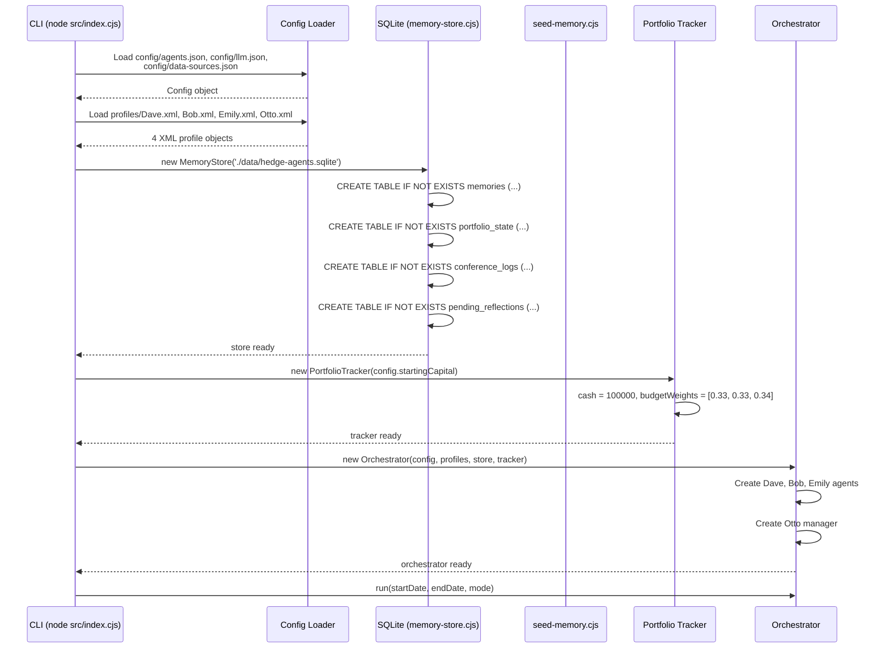
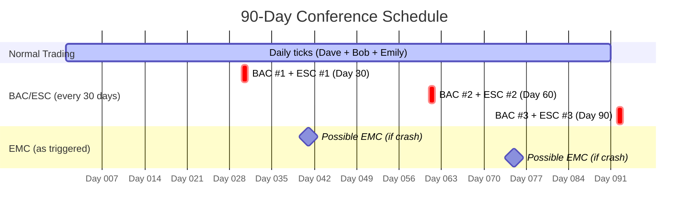
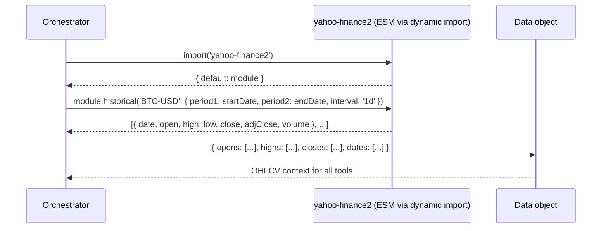
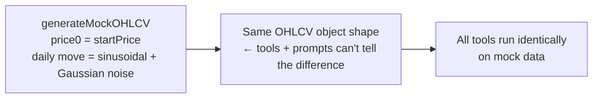

# Chapter 9 — End-to-End Data Flow

## Overview

This chapter traces the complete journey of information through HedgeAgents — from raw market prices on day 1, through 30 days of trading decisions, conferences, and reflections, to the final PRUDEX metrics report.

---

## System Startup



---

## Daily Tick — Complete Data Flow

```mermaid
flowchart TD
    START([Day begins]) --> PRICES

    subgraph FETCH["1. Fetch Market Data"]
        PRICES[Fetch OHLCV for each asset<br/>Real: yahoo-finance2 | Mock: sinusoidal generator]
        PRICES --> NEWS[Fetch news headlines<br/>Real: NewsAPI | Mock: template sentences]
    end

    FETCH --> REFLECT

    subgraph REFLECT["2. Process Pending Reflections"]
        REFLECT_CHECK{Any pending reflections<br/>from yesterday?}
        REFLECT_CHECK -->|Yes| REFLECT_RUN[For each agent:<br/>Compare yesterday's decision<br/>vs today's price<br/>→ LLM reflection<br/>→ Store M_IR memory]
        REFLECT_CHECK -->|No| SKIP[Skip]
    end

    REFLECT_RUN & SKIP --> EMC_CHECK

    subgraph EMC["3. Check EMC Triggers"]
        EMC_CHECK{Any asset moved<br/>>5% daily or<br/>>10% over 3 days?}
        EMC_CHECK -->|Yes| EMC_RUN[Run Extreme Market Conference<br/>→ 5 LLM calls<br/>→ Crisis agent adjusts strategy<br/>→ Log to conference_logs]
        EMC_CHECK -->|No| NO_EMC[Continue]
    end

    EMC_RUN & NO_EMC --> CONF_CHECK

    subgraph CONF["4. Check BAC/ESC Triggers"]
        CONF_CHECK{daysSinceBAC >= 30?}
        CONF_CHECK -->|Yes| BAC_RUN[Run BAC<br/>→ 4 LLM calls<br/>→ New budget weights set]
        CONF_CHECK -->|No| NO_CONF[Continue]
        BAC_RUN --> ESC_RUN[Run ESC<br/>→ 12 LLM calls<br/>→ New M_GE stored for all agents]
    end

    ESC_RUN & NO_CONF --> AGENT_TICKS

    subgraph TICKS["5. Agent Decision Ticks (parallel)"]
        direction LR
        DAVE_TICK[Dave Tick<br/>→ 12 tools in parallel<br/>→ Qt generation (LLM #1)<br/>→ Memory retrieval<br/>→ Decision (LLM #2)<br/>→ Execute on portfolio<br/>→ Store M_MI<br/>→ Store pending reflection]
        BOB_TICK[Bob Tick<br/>same flow]
        EMILY_TICK[Emily Tick<br/>same flow]

        DAVE_TICK & BOB_TICK & EMILY_TICK
    end

    AGENT_TICKS --> SNAPSHOT

    subgraph SNAP["6. Daily Snapshot"]
        SNAPSHOT[Update all asset prices<br/>Check trigger conditions<br/>Record daily snapshot<br/>→ Append to equityCurve<br/>→ Append to dailyReturns]
    end

    SNAPSHOT --> NEXT([Advance to next day])
```

---

## Memory Write Paths

Every memory write in the system originates from one of these trigger points:

```mermaid
graph LR
    subgraph WRITES["Memory Insert Triggers"]
        T1["Tool tick → M_MI<br/>(every agent, every day)"]
        T2["Reflection → M_IR<br/>(every agent, next day after trade)"]
        T3["ESC distillation → M_GE<br/>(every agent, every 30 days)"]
        T4["seed-memory.cjs → M_GE<br/>(once, on initialisation)"]
    end

    subgraph EMBED["Indexing Pipeline"]
        TFIDF["TF-IDF indexer:<br/>tokenize(content)<br/>→ update memories.tfidf_tokens"]
        VOYAGE["Voyage AI indexer:<br/>embed(content, 'voyage-finance-2')<br/>→ update memories.embedding"]
    end

    T1 & T2 & T3 & T4 --> INSERT[INSERT INTO memories (...)]
    INSERT --> ASYNC[Async indexing<br/>non-blocking to main loop]
    ASYNC --> TFIDF
    ASYNC --> VOYAGE
```

---

## Memory Read Paths

Memories are read in 3 places:

```mermaid
graph LR
    READ1["Agent decision loop<br/>retrieveTopK(Qt, K=5)<br/>→ injected into decision prompt"]
    READ2["ESC case generation<br/>getTopExperiences(agentName, 1)<br/>→ most instructive M_IR case"]
    READ3["BAC report generation<br/>getRecentPerformance(agentName, 30 days)<br/>→ performance metrics only"]

    READ1 & READ2 & READ3 --> STORE[MemoryStore.getRetrievableMemories()]
    STORE --> DB[(SQLite)]
```

---

## Conference Scheduling



---

## OHLCV Data Flow — Real vs Mock

### Real Mode (`node src/index.cjs --days 30`)



### Mock Mode (`node src/index.cjs --mock --days 30`)



```javascript
// Sinusoidal + noise formula
const trend = Math.sin(day / 30 * Math.PI) * 0.002;  // 0.2% sinusoidal drift
const noise = (Math.random() - 0.5) * 0.04;           // ±4% random noise
price = prevPrice * (1 + trend + noise);
```

Mock mode is identical to real mode from the tools' and LLM's perspective — every analysis, every memory write, every conference runs exactly the same way.

---

## News Data Flow

```mermaid
flowchart LR
    subgraph REAL["Real Mode"]
        NEWS_API[NewsAPI.org<br/>GET /v2/everything?q=Bitcoin&apiKey=...]
        NEWS_API --> PARSE[Parse JSON → extract titles]
        PARSE --> CAP[Cap at 10 headlines]
    end

    subgraph MOCK["Mock Mode"]
        MOCK_NEWS[Template generator<br/>'Bitcoin surges {pct}% on institutional demand'<br/>'Federal Reserve signals pause on rate hikes'<br/>Shuffled randomly]
    end

    REAL & MOCK --> NEWS_CTX[news: ['headline1', 'headline2', ...]]
    NEWS_CTX --> TOOLS[technicalIndicators tool<br/>(passes through unchanged)]
    NEWS_CTX --> PROMPT[Decision prompt<br/>## Recent News section]
```

---

## Portfolio State — Complete Data Flow

```mermaid
sequenceDiagram
    participant AGENT as Dave
    participant TRACKER as Portfolio Tracker
    participant DB as SQLite

    Note over AGENT,TRACKER: Each morning (before decision)
    AGENT->>TRACKER: getPortfolioState()
    TRACKER-->>AGENT: {
        totalValue: 102326,
        cash: 61394,
        positions: { Dave: { qty: 0.44, avgCost: 45200, unrealisedPnl: 836 } },
        budgetWeights: { Dave: 0.50, Bob: 0.30, Emily: 0.20 }
    }

    Note over AGENT,TRACKER: After decision
    AGENT->>TRACKER: executeAction('Dave', { action: 'Buy', qty_pct: 0.30, price: 47100 })
    TRACKER->>TRACKER: availableCash = 51000 * 0.50 - 20724 = 4776
    TRACKER->>TRACKER: tradeCost = 4776 * 0.30 = 1433
    TRACKER->>TRACKER: tradeQty = 1433 / 47100 = 0.0304
    TRACKER->>TRACKER: position.qty += 0.0304 → 0.4704
    TRACKER->>TRACKER: position.avgCost = weighted avg

    Note over AGENT,TRACKER: End of day
    AGENT->>TRACKER: recordDailySnapshot('2024-01-16')
    TRACKER->>TRACKER: equityCurve.push(103240)
    TRACKER->>TRACKER: dailyReturns.push(0.0089)
    TRACKER->>DB: savePortfolioState(JSON.stringify(snapshot))
```

---

## Output Files

At end of a run or backtest, the orchestrator writes:

| File | Contents | Format |
|------|---------|--------|
| `tests/e2e/output/equity-curve-{ts}.csv` | Date, total value, daily return | CSV |
| `tests/e2e/output/trade-log-{ts}.csv` | Date, agent, action, price, qty, cost | CSV |
| `data/hedge-agents.sqlite` | All memories, conference logs, portfolio states | SQLite |

### Equity Curve CSV Example
```csv
date,totalValue,dailyReturn,cumulativeReturn
2024-01-01,100000.00,0.0000,0.0000
2024-01-02,100210.50,0.0021,0.0021
2024-01-03,99890.30,-0.0032,-0.0011
...
2024-01-30,108240.00,0.0089,0.0824
```

### Trade Log CSV Example
```csv
date,agentName,action,price,qty,tradeCost,stopLossPrice,takeProfitPrice
2024-01-05,Dave,Buy,44280,0.2262,10010.74,42066.00,48708.00
2024-01-12,Bob,Buy,37800,0.5291,19999.99,35910.00,41580.00
2024-01-18,Dave,Sell,47100,0.2262,10653.22,0,0
```

---

## PRUDEX Computation Flow

```mermaid
graph LR
    CURVE[equityCurve array<br/>[100000, 100210, 99890, ...]] --> RETURNS[Compute daily returns<br/>ri = (Vi+1 - Vi) / Vi]

    RETURNS --> METRICS

    subgraph METRICS["computePRUDEX(dailyReturns, budgetWeights, riskFreeRate)"]
        TR[TR = ∏(1+ri) - 1]
        ARR[ARR = TR^(252/N) - 1]
        SR[SR = (ARR - RFR) / AnnVol]
        MDD[MDD = max peak-to-trough]
        CR[CR = ARR / MDD]
        SOR[SoR = ARR / DownsideDev]
        VOL[Vol = √252 × std(ri)]
        ENT[ENT = -Σwi·ln(wi)]
        ENB[ENB = 1 / Σwi²]
    end

    METRICS --> TABLE[formatMetricsTable() → terminal output]
    METRICS --> RETURN[Return to caller for<br/>analysis / logging]
```

---

## Full 30-Day Simulation: Numbers

For a 30-day simulation with 3 analysts on real data:

| Category | Count |
|----------|-------|
| Trading days processed | 30 |
| Agent ticks | 90 (3 × 30) |
| LLM calls for Qt | 90 |
| LLM calls for decisions | 90 |
| LLM calls for reflections | ~80 (some Hold days skipped) |
| BAC calls | 4 (1 BAC day) |
| ESC calls | 12 (1 ESC day) |
| EMC calls | 0–15 (varies) |
| **Total LLM calls** | **~276–291** |
| M_MI memories written | 90 |
| M_IR memories written | ~80 |
| M_GE memories written | ~15 (ESC) |
| **Total memories created** | **~185** |
| Estimated cost | **~$1.50–$2.50** |
