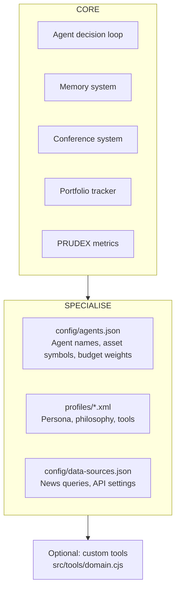

# Chapter 10 — Template Guide: Creating New Domains

## Overview

HedgeAgents is designed to be **domain-agnostic**. The default setup covers Bitcoin, Dow Jones, and EUR/USD — but the system can analyse any tradeable asset. This chapter explains how to specialise it for a different domain with minimal code changes.

The template system is in `templates/` with working examples.

---

## What You're Changing



---

## Step 1: Define Your Agents

Edit `config/agents.json`:

```json
{
  "startingCapital": 100000,
  "budgetWeights": {
    "Sara":  0.40,
    "Raj":   0.35,
    "Otto":  0.25
  },
  "agents": [
    {
      "name": "Sara",
      "role": "analyst",
      "asset": "ETH-USD",
      "assetLabel": "Ethereum",
      "profilePath": "./profiles/Sara.xml"
    },
    {
      "name": "Raj",
      "role": "analyst",
      "asset": "SOL-USD",
      "assetLabel": "Solana",
      "profilePath": "./profiles/Raj.xml"
    },
    {
      "name": "Otto",
      "role": "manager",
      "profilePath": "./profiles/Otto.xml"
    }
  ]
}
```

**Rules:**
- `asset` must be a valid yahoo-finance2 ticker (`BTC-USD`, `^GSPC`, `AAPL`, `EURUSD=X`, etc.)
- One `role: "manager"` required — this is the BAC/ESC orchestrator (Otto by convention)
- Budget weights must sum to 1.0

---

## Step 2: Write Agent Profiles (XML)

Each analyst gets a profile file at `profiles/<Name>.xml`. The structure:

```xml
<?xml version="1.0" encoding="UTF-8"?>
<agentProfile>
  <!-- IDENTITY -->
  <name>Sara</name>
  <role>analyst</role>
  <asset>ETH-USD</asset>
  <assetLabel>Ethereum</assetLabel>
  
  <!-- PERSONA: This is injected as the LLM system prompt -->
  <description>
    You are Sara, a sophisticated cryptocurrency analyst specialising in Ethereum and 
    the DeFi ecosystem. You focus on layer-2 scaling developments, smart contract 
    activity, and staking yield as key valuation drivers. You are methodical and 
    data-driven, with a strong preference for momentum strategies confirmed by 
    on-chain metrics. You manage capital with disciplined risk controls, never 
    deploying more than 60% in a single position.
  </description>

  <!-- DECISION PHILOSOPHY: Influences every decision prompt -->
  <decisionPhilosophy>
    <primaryStrategy>Momentum-based trend following with on-chain confirmation</primaryStrategy>
    <riskTolerance>medium-high</riskTolerance>
    <positionSizing>Kelly criterion adjusted for volatility regime</positionSizing>
    <stopLossApproach>ATR-based with 1.5× multiplier</stopLossApproach>
    <takeProfitApproach>Partial exits at Fibonacci extensions: 38.2%, 61.8%, 100%</takeProfitApproach>
    <timeHorizon>medium-term (7-21 days)</timeHorizon>
  </decisionPhilosophy>

  <!-- TOOLS: Only these run for Sara on each tick -->
  <toolPermissions>
    <tool>technicalIndicators</tool>
    <tool>trendAnalysis</tool>
    <tool>volumeAnalysis</tool>
    <tool>supportResistance</tool>
    <tool>drawdownAnalysis</tool>
    <tool>volatilityRegime</tool>
    <tool>riskMetrics</tool>
    <tool>newsAnalysis</tool>
    <tool>cryptoSentiment</tool>
    <tool>regulatoryScanner</tool>
    <!-- Custom tool (see Step 4) -->
    <tool>defiMetrics</tool>
  </toolPermissions>

  <!-- MEMORY CONFIG -->
  <memoryConfig>
    <maxRetrievedMemories>5</maxRetrievedMemories>
    <minSimilarityThreshold>0.3</minSimilarityThreshold>
    <memoryRetentionDays>365</memoryRetentionDays>
  </memoryConfig>
</agentProfile>
```

### Writing a Good `<description>`

The description is the most impactful field — it becomes the LLM's system prompt and shapes every decision. Good descriptions include:

1. **Who the agent is** — name, role, domain expertise
2. **What they focus on** — key metrics, signals they care about
3. **Their personality** — methodical / aggressive / conservative / patient
4. **Hard rules** — "never more than X%", "always reduce before central bank meetings"

### Available Tools Catalogue

```xml
<!-- Universal (all agents) -->
<tool>technicalIndicators</tool>   <!-- RSI, MACD, BB, ATR, Stoch, EMA/SMA -->
<tool>trendAnalysis</tool>          <!-- Trend direction + strength -->
<tool>supportResistance</tool>      <!-- Key S/R levels -->
<tool>volumeAnalysis</tool>         <!-- Volume ratio, abnormal volume detection -->
<tool>volatilityRegime</tool>       <!-- LOW/MEDIUM/HIGH/EXTREME classification -->
<tool>drawdownAnalysis</tool>       <!-- Current DD, max DD, days underwater -->
<tool>riskMetrics</tool>            <!-- TR, ARR, SR, SoR, MDD, VaR, CVaR -->
<tool>newsAnalysis</tool>           <!-- Passes headlines to LLM context -->

<!-- Crypto (BTC-style assets) -->
<tool>blockchainMetrics</tool>      <!-- Hash rate, difficulty, mempool -->
<tool>cryptoSentiment</tool>        <!-- Fear & Greed Index -->
<tool>halvingCycleAnalysis</tool>   <!-- BTC-specific cycle phase -->
<tool>regulatoryScanner</tool>      <!-- Regulatory risk from headlines -->

<!-- Equities -->
<tool>earningsCalendar</tool>       <!-- Upcoming earnings dates -->
<tool>fundamentalValuation</tool>   <!-- 52-week position proxy for valuation -->
<tool>sectorRotation</tool>         <!-- Inter-sector capital flow signals -->

<!-- Forex -->
<tool>interestRateDifferential</tool>  <!-- Rate differential carry trade signal -->
<tool>centralBankMonitor</tool>        <!-- Upcoming CB meeting dates -->
<tool>geopoliticalRisk</tool>          <!-- Political risk from headlines -->

<!-- Macro (Otto or any agent) -->
<tool>macroEconomicCalendar</tool>  <!-- CPI, NFP, GDP release dates -->

<!-- Portfolio management (Otto only) -->
<tool>portfolioOptimizer</tool>     <!-- Mean-variance optimisation -->
<tool>stressTester</tool>           <!-- Shock scenario analysis -->
```

---

## Step 3: Configure Data Sources

Edit `config/data-sources.json`:

```json
{
  "news": {
    "provider": "newsapi",
    "apiKey": "YOUR_NEWSAPI_KEY",
    "queries": {
      "Sara": "Ethereum OR DeFi OR ETH staking layer-2",
      "Raj":  "Solana OR SOL DeFi NFT",
      "Otto": "cryptocurrency market outlook portfolio risk"
    },
    "maxHeadlines": 10
  },
  "prices": {
    "provider": "yahoo-finance2",
    "interval": "1d"
  }
}
```

**Query tuning tips:**
- Use the asset name + common abbreviation + 2-3 relevant keywords
- More specific = fewer irrelevant headlines = better LLM signal
- Too narrow = fewer headlines = LLM lacks news context

---

## Step 4: Add Custom Domain Tools (Optional)

If your domain has unique metrics not covered by existing tools, add them to `src/tools/domain.cjs`:

```javascript
/**
 * Ethereum-specific: DeFi ecosystem health metrics
 */
async function getDefiMetrics(ctx) {
    const { symbol, news } = ctx;
    
    // Example: fetch from DefiLlama (free API)
    const response = await fetch('https://api.llama.fi/protocol/ethereum');
    const data = await response.json();
    
    const tvl = data.tvl?.[data.tvl.length - 1]?.totalLiquidityUSD ?? 0;
    const tvlChange30d = ...;
    
    // Scan news for DeFi-specific signals
    const defiKeywords = ['TVL', 'liquidity', 'yield farming', 'staking', 'protocol'];
    const defiNewsCount = news.filter(h => 
        defiKeywords.some(kw => h.toLowerCase().includes(kw.toLowerCase()))
    ).length;

    const signal = tvlChange30d > 0.05 ? 'INFLOW' 
                 : tvlChange30d < -0.05 ? 'OUTFLOW' 
                 : 'STABLE';

    return {
        tvlBillions: (tvl / 1e9).toFixed(2),
        tvlChange30dPct: (tvlChange30d * 100).toFixed(1),
        signal,
        defiNewsMentions: defiNewsCount,
        interpretation: `DeFi TVL ${signal.toLowerCase()} detected. ${defiNewsCount} DeFi-specific headlines.`
    };
}

// Add to TOOLS registry in registry.cjs:
// defiMetrics: async (ctx) => domain.getDefiMetrics(ctx),
```

**Always return an `interpretation` field** — this gives the LLM a plain-language summary when it can't parse the numbers correctly.

---

## Step 5: Pre-Seed Expert Knowledge

Edit or extend `scripts/seed-memory.cjs` with domain-specific principles:

```javascript
const expertPrinciples = [
    {
        agentName: 'Sara',
        content: {
            type: 'domain_principle',
            principle: 'Ethereum network upgrades (hard forks, EIPs) create temporary volatility. Reduce position 3 days before known upgrade dates, re-enter 24h after successful completion.',
            source: 'ETH ecosystem expert',
            applicable_to: 'ETH-USD around network events',
            confidence: 0.85
        }
    },
    {
        agentName: 'Sara',
        content: {
            type: 'domain_principle',
            principle: 'DeFi TVL and ETH price are positively correlated (r≈0.78). Rising TVL confirms bull trend; falling TVL during price rise = divergence = exit signal.',
            source: 'On-chain analytics research',
            applicable_to: 'ETH-USD trend confirmation',
            confidence: 0.80
        }
    },
    // ... more principles
];
```

Run once: `node scripts/seed-memory.cjs`

---

## Step 6: Run and Validate

```bash
# Test with mock data first (no API calls, no cost)
node src/index.cjs --mock --days 10

# Check that all 3 agents are making decisions
# Look for: "Dave decided: Buy" or "Raj decided: Hold"

# Test for 30 days with real data
node src/index.cjs --days 30

# Full backtest over historical period
node scripts/backtest.cjs --start 2023-01-01 --end 2023-12-31

# Paper trading (runs daily against live market)
node scripts/paper-trade.cjs
```

---

## Pre-Built Template Examples

The `templates/` folder contains 3 ready-to-use domain configurations:

### Template A: Crypto-Only (`templates/crypto-trio/`)

Three crypto analysts covering BTC, ETH, and SOL. Good for DeFi-native users.

```
Alice (BTC) / Raj (ETH) / Mia (SOL) / Otto (Manager)
Tools: blockchain metrics, DeFi metrics, F&G, halving cycle
```

### Template B: Macro Equities (`templates/macro-equities/`)

Traditional macro portfolio: US equities, bonds, gold.

```
Sam (S&P 500) / Grace (10Y Treasury) / Leo (Gold) / Otto (Manager)
Tools: earnings calendar, fundamental valuation, sector rotation, macro calendar, Fed monitor
```

### Template C: FX Multi-Pair (`templates/fx-multi/`)

Three forex pairs covering major crosses.

```
Maya (EURUSD=X) / Jin (USDJPY=X) / Rose (GBPUSD=X) / Otto (Manager)
Tools: interest rate differential, central bank monitor, geopolitical risk, carry trade analysis
```

---

## Template Specialisation Checklist

When adapting HedgeAgents for a new domain:

```
[ ] config/agents.json — names, assets (valid yahoo-finance2 tickers), budget weights
[ ] profiles/*.xml — one XML per analyst + one for Otto
       [ ] <description> captures personality + domain expertise + hard rules
       [ ] <toolPermissions> lists only relevant tools
       [ ] <decisionPhilosophy> matches the asset's characteristics
[ ] config/data-sources.json — news queries per agent
[ ] scripts/seed-memory.cjs — 3-5 expert principles per analyst agent
[ ] src/tools/domain.cjs — any custom domain tools (optional)
[ ] src/tools/registry.cjs — register custom tools (if added)
[ ] .secrets — ANTHROPIC_API_KEY (and optionally VOYAGE_API_KEY, NEWS_API_KEY)
[ ] Test: node src/index.cjs --mock --days 5 (should complete with no errors)
[ ] Test: node --test tests/unit/*.test.cjs (87 tests should still pass)
```

---

## Common Pitfalls

| Pitfall | Symptom | Fix |
|---------|---------|-----|
| Wrong yahoo-finance2 ticker | `Error: No fundamentals data` | Test with `yf.historical('XYZ', {...})` interactively |
| Tool not in registry | `Tool X not found in toolResults` | Add to `TOOLS` object in `registry.cjs` |
| `<description>` too short | LLM makes generic non-specialist decisions | Expand to 3-5 sentences with specific rules |
| Budget weights don't sum to 1 | Optimizer crashes | Always verify: `0.40 + 0.35 + 0.25 = 1.00` |
| News query too broad | Too many irrelevant headlines → noise | Narrow with `site:reuters.com OR site:bloomberg.com` |
| No expert seed | Agents lack baseline principles for first 30 days | Always run `seed-memory.cjs` before first live run |

---

## What Stays Constant

No matter what domain you specialise for, these **never change**:

- The 7-step agent decision loop (`base-agent.cjs`)
- The three memory types (M_MI / M_IR / M_GE) and their lifecycle
- The conference system (BAC / ESC / EMC) and their trigger logic
- The portfolio tracker and trade execution engine
- The 9 PRUDEX metrics and their formulas
- The ClaudeClient and all 12 prompt templates (parameters change, structure doesn't)
- The TF-IDF / Voyage AI retrieval system

**The system is the framework. Profiles + config are the domain.** Changing the domain takes 30–60 minutes. Building the system took months.
